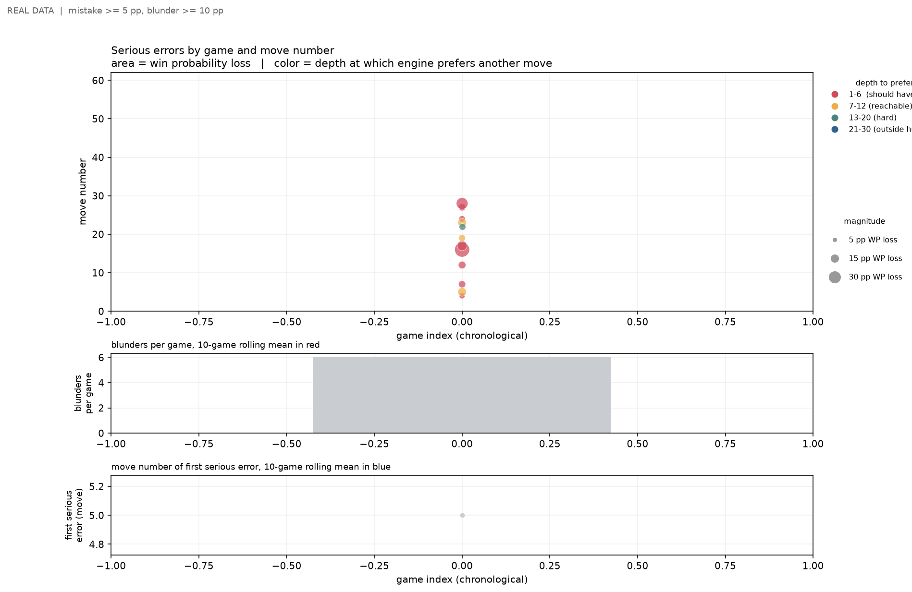

# Blunder Report

Generated from 1 analyzed game(s).

| Game # | Game ID | Date | Move | Class | Type | WP loss | Depth | Report |
|---:|---|---|---|---|---|---:|---:|---|
| 0 | 171926193190 | 2026.07.22 | 4.Bf4 | inaccuracy | positional | 6 | 1 | reports/171926193190_20260722T162748Z_white.md |
| 0 | 171926193190 | 2026.07.22 | 5.g3 | mistake | positional | 13 | 8 | reports/171926193190_20260722T162748Z_white.md |
| 0 | 171926193190 | 2026.07.22 | 7.f3 | inaccuracy | positional | 9 | 1 | reports/171926193190_20260722T162748Z_white.md |
| 0 | 171926193190 | 2026.07.22 | 12.Ke2 | mistake | positional | 10 | 1 | reports/171926193190_20260722T162748Z_white.md |
| 0 | 171926193190 | 2026.07.22 | 16.Bh3 | blunder | tactical | 39 | 1 | reports/171926193190_20260722T162748Z_white.md |
| 0 | 171926193190 | 2026.07.22 | 17.Kf2 | mistake | tactical | 17 | 1 | reports/171926193190_20260722T162748Z_white.md |
| 0 | 171926193190 | 2026.07.22 | 19.Ke3 | inaccuracy | positional | 8 | 9 | reports/171926193190_20260722T162748Z_white.md |
| 0 | 171926193190 | 2026.07.22 | 22.Qe3 | inaccuracy | positional | 8 | 19 | reports/171926193190_20260722T162748Z_white.md |
| 0 | 171926193190 | 2026.07.22 | 23.Qd4 | mistake | tactical | 13 | 7 | reports/171926193190_20260722T162748Z_white.md |
| 0 | 171926193190 | 2026.07.22 | 24.Qc4 | inaccuracy | positional | 7 | 1 | reports/171926193190_20260722T162748Z_white.md |
| 0 | 171926193190 | 2026.07.22 | 27.e5 | inaccuracy | positional | 9 | 6 | reports/171926193190_20260722T162748Z_white.md |
| 0 | 171926193190 | 2026.07.22 | 28.Kb5 | blunder | tactical | 24 | 1 | reports/171926193190_20260722T162748Z_white.md |
