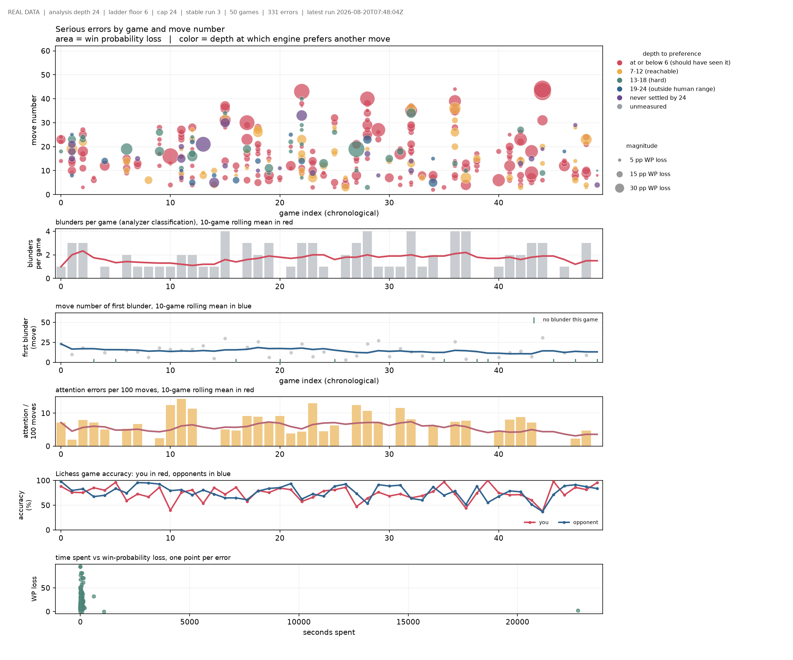

# Blunder Report

REAL DATA  |  analysis depth 24  |  ladder floor 6  |  cap 24  |  stable run 3  |  43 games  |  297 errors  |  latest run 2026-08-05T09:47:34Z

Depth column: an integer is a measured depth. `<=floor` means the engine stably preferred the move at or below depth 6, which is as shallow as this measurement resolves. `>cap` means it never settled within depth 24. `unmeasured` means the measurement was invalid and the row is kept but not binned.

| Game # | Game ID | Date | Move | Class | Category | WP loss | Depth | Refute | Seconds | Pre-error | Report |
|---:|---|---|---|---|---|---:|---|---|---:|---|---|
| 0 | d10087e9-82cf-11f1-bc12-27231f01000f | 2026.07.18 | 14.Bxf6 | inaccuracy | attention | 6.0 | <=floor | 1 | 130.2 | balanced | [171750428224_20260718T181319Z_white.md](reports/2026/07/18/171750428224_20260718T181319Z_white.md) |
| 0 | d10087e9-82cf-11f1-bc12-27231f01000f | 2026.07.18 | 18.Rad1 | inaccuracy | brilliant_sacrifice | 5.8 | 16 | 3 | 48.2 | balanced | [171750428224_20260718T181319Z_white.md](reports/2026/07/18/171750428224_20260718T181319Z_white.md) |
| 0 | d10087e9-82cf-11f1-bc12-27231f01000f | 2026.07.18 | 22.Bxf7+ | inaccuracy | attention | 7.8 | <=floor | 1 | 7.1 | balanced | [171750428224_20260718T181319Z_white.md](reports/2026/07/18/171750428224_20260718T181319Z_white.md) |
| 0 | d10087e9-82cf-11f1-bc12-27231f01000f | 2026.07.18 | 23.Qh5 | blunder | missed_tactic | 27.5 | <=floor | 5 | 45.5 | balanced | [171750428224_20260718T181319Z_white.md](reports/2026/07/18/171750428224_20260718T181319Z_white.md) |
| 0 | d10087e9-82cf-11f1-bc12-27231f01000f | 2026.07.18 | 24.Qxf7+ | inaccuracy | attention | 6.5 | <=floor | 1 | 22.7 | losing | [171750428224_20260718T181319Z_white.md](reports/2026/07/18/171750428224_20260718T181319Z_white.md) |
| 1 | 0b0abfa6-8397-11f1-998b-190e3501000f | 2026.07.19 | 8...Nxe4 | inaccuracy | allowed_tactic | 6.0 | 23 | 1 | 13.0 | winning | [171795040624_20260719T180705Z_black.md](reports/2026/07/19/171795040624_20260719T180705Z_black.md) |
| 1 | 0b0abfa6-8397-11f1-998b-190e3501000f | 2026.07.19 | 9...Bg4 | inaccuracy | opening | 5.9 | <=floor | 11 | 3.2 | winning | [171795040624_20260719T180705Z_black.md](reports/2026/07/19/171795040624_20260719T180705Z_black.md) |
| 1 | 0b0abfa6-8397-11f1-998b-190e3501000f | 2026.07.19 | 10...Ne5 | blunder | attention | 22.4 | <=floor | 2 | 24.4 | winning | [171795040624_20260719T180705Z_black.md](reports/2026/07/19/171795040624_20260719T180705Z_black.md) |
| 1 | 0b0abfa6-8397-11f1-998b-190e3501000f | 2026.07.19 | 13...f5 | mistake | positional | 16.9 | <=floor | 4 | 22.5 | winning | [171795040624_20260719T180705Z_black.md](reports/2026/07/19/171795040624_20260719T180705Z_black.md) |
| 1 | 0b0abfa6-8397-11f1-998b-190e3501000f | 2026.07.19 | 14...O-O | mistake | allowed_tactic | 19.6 | <=floor | 6 | 13.8 | winning | [171795040624_20260719T180705Z_black.md](reports/2026/07/19/171795040624_20260719T180705Z_black.md) |
| 1 | 0b0abfa6-8397-11f1-998b-190e3501000f | 2026.07.19 | 15...Rad8 | mistake | missed_tactic | 13.7 | >cap | 8 | 17.7 | winning | [171795040624_20260719T180705Z_black.md](reports/2026/07/19/171795040624_20260719T180705Z_black.md) |
| 1 | 0b0abfa6-8397-11f1-998b-190e3501000f | 2026.07.19 | 18...h6 | mistake | allowed_tactic | 19.6 | >cap | >18 | 126.3 | winning | [171795040624_20260719T180705Z_black.md](reports/2026/07/19/171795040624_20260719T180705Z_black.md) |
| 1 | 0b0abfa6-8397-11f1-998b-190e3501000f | 2026.07.19 | 19...g5 | blunder | allowed_tactic | 37.7 | 7 | 2 | 23.5 | winning | [171795040624_20260719T180705Z_black.md](reports/2026/07/19/171795040624_20260719T180705Z_black.md) |
| 1 | 0b0abfa6-8397-11f1-998b-190e3501000f | 2026.07.19 | 21...Bd6 | mistake | brilliant_sacrifice | 19.4 | >cap | 10 | 25.3 | balanced | [171795040624_20260719T180705Z_black.md](reports/2026/07/19/171795040624_20260719T180705Z_black.md) |
| 1 | 0b0abfa6-8397-11f1-998b-190e3501000f | 2026.07.19 | 23...Kg7 | blunder | brilliant_sacrifice | 21.6 | 13 | 6 | 90.5 | balanced | [171795040624_20260719T180705Z_black.md](reports/2026/07/19/171795040624_20260719T180705Z_black.md) |
| 1 | 0b0abfa6-8397-11f1-998b-190e3501000f | 2026.07.19 | 25...Rh8 | inaccuracy | positional | 5.1 | 19 | 1 | 66.0 | losing | [171795040624_20260719T180705Z_black.md](reports/2026/07/19/171795040624_20260719T180705Z_black.md) |
| 2 | 3b953a42-8394-11f1-b9ec-2f831301000f | 2026.07.19 | 3...Bc5 | inaccuracy | allowed_tactic | 5.1 | <=floor | >18 | 10.7 | balanced | [171794224796_20260719T172411Z_black.md](reports/2026/07/19/171794224796_20260719T172411Z_black.md) |
| 2 | 3b953a42-8394-11f1-b9ec-2f831301000f | 2026.07.19 | 11...Be6 | mistake | missed_tactic | 15.8 | <=floor | 4 | 78.7 | winning | [171794224796_20260719T172411Z_black.md](reports/2026/07/19/171794224796_20260719T172411Z_black.md) |
| 2 | 3b953a42-8394-11f1-b9ec-2f831301000f | 2026.07.19 | 15...Nxc3 | mistake | attention | 14.6 | <=floor | 2 | 20.4 | winning | [171794224796_20260719T172411Z_black.md](reports/2026/07/19/171794224796_20260719T172411Z_black.md) |
| 2 | 3b953a42-8394-11f1-b9ec-2f831301000f | 2026.07.19 | 17...d5 | inaccuracy | attention | 9.8 | <=floor | 1 | 40.0 | balanced | [171794224796_20260719T172411Z_black.md](reports/2026/07/19/171794224796_20260719T172411Z_black.md) |
| 2 | 3b953a42-8394-11f1-b9ec-2f831301000f | 2026.07.19 | 18...e5 | blunder | missed_tactic | 35.4 | <=floor | 3 | 58.1 | balanced | [171794224796_20260719T172411Z_black.md](reports/2026/07/19/171794224796_20260719T172411Z_black.md) |
| 2 | 3b953a42-8394-11f1-b9ec-2f831301000f | 2026.07.19 | 22...Rf3 | blunder | allowed_tactic | 23.1 | 12 | 11 | 15.8 | losing | [171794224796_20260719T172411Z_black.md](reports/2026/07/19/171794224796_20260719T172411Z_black.md) |
| 2 | 3b953a42-8394-11f1-b9ec-2f831301000f | 2026.07.19 | 23...h5 | mistake | missed_tactic | 12.6 | 18 | 8 | 25.3 | losing | [171794224796_20260719T172411Z_black.md](reports/2026/07/19/171794224796_20260719T172411Z_black.md) |
| 2 | 3b953a42-8394-11f1-b9ec-2f831301000f | 2026.07.19 | 24...a5 | inaccuracy | allowed_tactic | 9.2 | 14 | 4 | 21.0 | losing | [171794224796_20260719T172411Z_black.md](reports/2026/07/19/171794224796_20260719T172411Z_black.md) |
| 2 | 3b953a42-8394-11f1-b9ec-2f831301000f | 2026.07.19 | 25...Kh7 | blunder | missed_tactic | 21.3 | <=floor | 9 | 26.3 | losing | [171794224796_20260719T172411Z_black.md](reports/2026/07/19/171794224796_20260719T172411Z_black.md) |
| 2 | 3b953a42-8394-11f1-b9ec-2f831301000f | 2026.07.19 | 27...exd3 | inaccuracy | attention | 9.3 | <=floor | 2 | 1.6 | losing | [171794224796_20260719T172411Z_black.md](reports/2026/07/19/171794224796_20260719T172411Z_black.md) |
| 3 | 4431135e-835d-11f1-bc12-27231f01000f | 2026.07.19 | 6.d4 | mistake | attention | 12.2 | <=floor | 1 | 17.7 | balanced | [171778732108_20260719T104812Z_white.md](reports/2026/07/19/171778732108_20260719T104812Z_white.md) |
| 3 | 4431135e-835d-11f1-bc12-27231f01000f | 2026.07.19 | 7.d5 | inaccuracy | allowed_tactic | 6.1 | <=floor | 7 | 21.2 | balanced | [171778732108_20260719T104812Z_white.md](reports/2026/07/19/171778732108_20260719T104812Z_white.md) |
| 4 | 8e1357de-8307-11f1-80f3-72a72901000b | 2026.07.19 | 12.Nd4 | blunder | attention | 32.1 | <=floor | 1 | 611.3 | winning | [1001249768_20260720T204435Z_white.md](reports/2026/07/20/1001249768_20260720T204435Z_white.md) |
| 4 | 8e1357de-8307-11f1-80f3-72a72901000b | 2026.07.19 | 14.Qf3 | mistake | brilliant_sacrifice | 14.7 | 24 | 8 | 31.1 | balanced | [1001249768_20260720T204435Z_white.md](reports/2026/07/20/1001249768_20260720T204435Z_white.md) |
| 6 | 11ef4557-848b-11f1-a2b8-d7df4901000f | 2026.07.20 | 9...Bd7 | inaccuracy | allowed_tactic | 8.7 | <=floor | 6 | 4.0 | balanced | [171848454352_20260720T224316Z_black.md](reports/2026/07/20/171848454352_20260720T224316Z_black.md) |
| 6 | 11ef4557-848b-11f1-a2b8-d7df4901000f | 2026.07.20 | 10...a6 | mistake | allowed_tactic | 12.4 | 9 | 7 | 5.6 | balanced | [171848454352_20260720T224316Z_black.md](reports/2026/07/20/171848454352_20260720T224316Z_black.md) |
| 6 | 11ef4557-848b-11f1-a2b8-d7df4901000f | 2026.07.20 | 11...Bb5 | mistake | attention | 18.6 | <=floor | 1 | 15.3 | balanced | [171848454352_20260720T224316Z_black.md](reports/2026/07/20/171848454352_20260720T224316Z_black.md) |
| 6 | 11ef4557-848b-11f1-a2b8-d7df4901000f | 2026.07.20 | 13...b5 | inaccuracy | positional | 9.3 | <=floor | 3 | 6.5 | balanced | [171848454352_20260720T224316Z_black.md](reports/2026/07/20/171848454352_20260720T224316Z_black.md) |
| 6 | 11ef4557-848b-11f1-a2b8-d7df4901000f | 2026.07.20 | 14...Ne4 | mistake | allowed_tactic | 19.2 | 11 | 1 | 84.0 | balanced | [171848454352_20260720T224316Z_black.md](reports/2026/07/20/171848454352_20260720T224316Z_black.md) |
| 6 | 11ef4557-848b-11f1-a2b8-d7df4901000f | 2026.07.20 | 15...Bxh2+ | blunder | missed_tactic | 22.2 | <=floor | 11 | 54.1 | balanced | [171848454352_20260720T224316Z_black.md](reports/2026/07/20/171848454352_20260720T224316Z_black.md) |
| 6 | 11ef4557-848b-11f1-a2b8-d7df4901000f | 2026.07.20 | 19...Nxf1 | blunder | missed_tactic | 43.1 | 14 | 1 | 2.1 | balanced | [171848454352_20260720T224316Z_black.md](reports/2026/07/20/171848454352_20260720T224316Z_black.md) |
| 7 | a9f7a99c-83dc-11f1-b9ec-2f831301000f | 2026.07.20 | 12...Bc5 | mistake | allowed_tactic | 16.1 | <=floor | 7 | 17.6 | balanced | [171808415550_20260720T015453Z_black.md](reports/2026/07/19/171808415550_20260720T015453Z_black.md) |
| 7 | a9f7a99c-83dc-11f1-b9ec-2f831301000f | 2026.07.20 | 13...d3 | blunder | attention | 20.8 | <=floor | 1 | 115.3 | losing | [171808415550_20260720T015453Z_black.md](reports/2026/07/19/171808415550_20260720T015453Z_black.md) |
| 7 | a9f7a99c-83dc-11f1-b9ec-2f831301000f | 2026.07.20 | 15...Rd8 | inaccuracy | allowed_tactic | 9.2 | >cap | 1 | 4.1 | losing | [171808415550_20260720T015453Z_black.md](reports/2026/07/19/171808415550_20260720T015453Z_black.md) |
| 8 | 7f79091a-855c-11f1-b3a4-a0dc1301000f | 2026.07.21 | 6...Nb4 | blunder | opening | 20.2 | 7 | 1 | 5.4 | balanced | [171896191634_20260721T233415Z_black.md](reports/2026/07/21/171896191634_20260721T233415Z_black.md) |
| 9 | a67dbaef-8533-11f1-bd1d-370ea001000f | 2026.07.21 | 12...Ng4 | inaccuracy | positional | 6.7 | <=floor | 4 | 16.2 | balanced | [171886517316_20260721T185536Z_black.md](reports/2026/07/21/171886517316_20260721T185536Z_black.md) |
| 9 | a67dbaef-8533-11f1-bd1d-370ea001000f | 2026.07.21 | 17...Nc7 | inaccuracy | positional | 6.5 | <=floor | 13 | 25.4 | winning | [171886517316_20260721T185536Z_black.md](reports/2026/07/21/171886517316_20260721T185536Z_black.md) |
| 9 | a67dbaef-8533-11f1-bd1d-370ea001000f | 2026.07.21 | 18...g5 | blunder | allowed_tactic | 28.1 | 15 | 2 | 12.1 | winning | [171886517316_20260721T185536Z_black.md](reports/2026/07/21/171886517316_20260721T185536Z_black.md) |
| 9 | a67dbaef-8533-11f1-bd1d-370ea001000f | 2026.07.21 | 21...e5 | inaccuracy | positional | 5.5 | <=floor | >18 | 24.1 | balanced | [171886517316_20260721T185536Z_black.md](reports/2026/07/21/171886517316_20260721T185536Z_black.md) |
| 9 | a67dbaef-8533-11f1-bd1d-370ea001000f | 2026.07.21 | 23...Kg7 | inaccuracy | allowed_tactic | 7.1 | <=floor | 5 | 33.7 | balanced | [171886517316_20260721T185536Z_black.md](reports/2026/07/21/171886517316_20260721T185536Z_black.md) |
| 9 | a67dbaef-8533-11f1-bd1d-370ea001000f | 2026.07.21 | 26...Nxg5 | mistake | missed_tactic | 17.5 | 14 | 16 | 2.6 | balanced | [171886517316_20260721T185536Z_black.md](reports/2026/07/21/171886517316_20260721T185536Z_black.md) |
| 9 | a67dbaef-8533-11f1-bd1d-370ea001000f | 2026.07.21 | 28...f4 | mistake | attention | 10.0 | <=floor | 1 | 17.8 | losing | [171886517316_20260721T185536Z_black.md](reports/2026/07/21/171886517316_20260721T185536Z_black.md) |
| 10 | da8858f7-855c-11f1-8391-941ec601000f | 2026.07.21 | 4...Bxc3 | inaccuracy | attention | 8.5 | <=floor | 2 | 34.3 | balanced | [171896252908_20260721T235026Z_black.md](reports/2026/07/21/171896252908_20260721T235026Z_black.md) |
| 10 | da8858f7-855c-11f1-8391-941ec601000f | 2026.07.21 | 13...gxh6 | inaccuracy | positional | 6.4 | <=floor | 6 | 24.3 | winning | [171896252908_20260721T235026Z_black.md](reports/2026/07/21/171896252908_20260721T235026Z_black.md) |
| 10 | da8858f7-855c-11f1-8391-941ec601000f | 2026.07.21 | 16...Re5 | blunder | attention | 81.2 | <=floor | 2 | 73.2 | winning | [171896252908_20260721T235026Z_black.md](reports/2026/07/21/171896252908_20260721T235026Z_black.md) |
| 11 | f465dcbc-8520-11f1-a7f2-dcc5ba01000f | 2026.07.21 | 6.d5 | inaccuracy | attention | 6.4 | <=floor | 2 | 61.3 | balanced | [171880980358_20260721T170757Z_white.md](reports/2026/07/21/171880980358_20260721T170757Z_white.md) |
| 11 | f465dcbc-8520-11f1-a7f2-dcc5ba01000f | 2026.07.21 | 7.Bb5 | inaccuracy | opening | 8.2 | >cap | 6 | 22.0 | balanced | [171880980358_20260721T170757Z_white.md](reports/2026/07/21/171880980358_20260721T170757Z_white.md) |
| 11 | f465dcbc-8520-11f1-a7f2-dcc5ba01000f | 2026.07.21 | 8.Bxd7+ | inaccuracy | attention | 8.3 | <=floor | 2 | 61.4 | balanced | [171880980358_20260721T170757Z_white.md](reports/2026/07/21/171880980358_20260721T170757Z_white.md) |
| 11 | f465dcbc-8520-11f1-a7f2-dcc5ba01000f | 2026.07.21 | 9.Bg5 | mistake | opening | 11.3 | 10 | 5 | 33.1 | balanced | [171880980358_20260721T170757Z_white.md](reports/2026/07/21/171880980358_20260721T170757Z_white.md) |
| 11 | f465dcbc-8520-11f1-a7f2-dcc5ba01000f | 2026.07.21 | 10.Be3 | inaccuracy | opening | 5.6 | 23 | >18 | 102.2 | balanced | [171880980358_20260721T170757Z_white.md](reports/2026/07/21/171880980358_20260721T170757Z_white.md) |
| 11 | f465dcbc-8520-11f1-a7f2-dcc5ba01000f | 2026.07.21 | 11.g4 | inaccuracy | positional | 8.4 | 13 | 4 | 73.4 | balanced | [171880980358_20260721T170757Z_white.md](reports/2026/07/21/171880980358_20260721T170757Z_white.md) |
| 11 | f465dcbc-8520-11f1-a7f2-dcc5ba01000f | 2026.07.21 | 15.Qd2 | blunder | positional | 23.2 | >cap | 15 | 124.4 | winning | [171880980358_20260721T170757Z_white.md](reports/2026/07/21/171880980358_20260721T170757Z_white.md) |
| 11 | f465dcbc-8520-11f1-a7f2-dcc5ba01000f | 2026.07.21 | 16.Bh6 | inaccuracy | positional | 9.2 | <=floor | >18 | 38.5 | winning | [171880980358_20260721T170757Z_white.md](reports/2026/07/21/171880980358_20260721T170757Z_white.md) |
| 11 | f465dcbc-8520-11f1-a7f2-dcc5ba01000f | 2026.07.21 | 19.Qg6 | inaccuracy | positional | 6.7 | 10 | >18 | 87.1 | winning | [171880980358_20260721T170757Z_white.md](reports/2026/07/21/171880980358_20260721T170757Z_white.md) |
| 11 | f465dcbc-8520-11f1-a7f2-dcc5ba01000f | 2026.07.21 | 20.Ne2 | mistake | positional | 10.1 | >cap | 1 | 69.0 | balanced | [171880980358_20260721T170757Z_white.md](reports/2026/07/21/171880980358_20260721T170757Z_white.md) |
| 11 | f465dcbc-8520-11f1-a7f2-dcc5ba01000f | 2026.07.21 | 23.O-O-O | mistake | positional | 13.4 | <=floor | 5 | 3.4 | winning | [171880980358_20260721T170757Z_white.md](reports/2026/07/21/171880980358_20260721T170757Z_white.md) |
| 11 | f465dcbc-8520-11f1-a7f2-dcc5ba01000f | 2026.07.21 | 24.b3 | mistake | allowed_tactic | 14.0 | <=floor | 4 | 24.2 | balanced | [171880980358_20260721T170757Z_white.md](reports/2026/07/21/171880980358_20260721T170757Z_white.md) |
| 11 | f465dcbc-8520-11f1-a7f2-dcc5ba01000f | 2026.07.21 | 25.cxb3 | mistake | attention | 13.1 | <=floor | 1 | 2.3 | balanced | [171880980358_20260721T170757Z_white.md](reports/2026/07/21/171880980358_20260721T170757Z_white.md) |
| 11 | f465dcbc-8520-11f1-a7f2-dcc5ba01000f | 2026.07.21 | 26.Ng3 | inaccuracy | attention | 9.6 | <=floor | 1 | 45.4 | balanced | [171880980358_20260721T170757Z_white.md](reports/2026/07/21/171880980358_20260721T170757Z_white.md) |
| 11 | f465dcbc-8520-11f1-a7f2-dcc5ba01000f | 2026.07.21 | 27.Rdf1 | blunder | attention | 24.9 | <=floor | 1 | 13.4 | balanced | [171880980358_20260721T170757Z_white.md](reports/2026/07/21/171880980358_20260721T170757Z_white.md) |
| 12 | 6cea6a25-85e6-11f1-8391-941ec601000f | 2026.07.22 | 4.Bf4 | inaccuracy | attention | 8.3 | <=floor | 2 | 26.1 | balanced | [171926193190_20260722T162748Z_white.md](reports/2026/07/22/171926193190_20260722T162748Z_white.md) |
| 12 | 6cea6a25-85e6-11f1-8391-941ec601000f | 2026.07.22 | 5.g3 | mistake | allowed_tactic | 13.9 | 23 | 7 | 32.1 | balanced | [171926193190_20260722T162748Z_white.md](reports/2026/07/22/171926193190_20260722T162748Z_white.md) |
| 12 | 6cea6a25-85e6-11f1-8391-941ec601000f | 2026.07.22 | 7.f3 | inaccuracy | attention | 8.7 | <=floor | 1 | 10.3 | balanced | [171926193190_20260722T162748Z_white.md](reports/2026/07/22/171926193190_20260722T162748Z_white.md) |
| 12 | 6cea6a25-85e6-11f1-8391-941ec601000f | 2026.07.22 | 12.Ke2 | inaccuracy | attention | 6.9 | <=floor | 1 | 71.8 | losing | [171926193190_20260722T162748Z_white.md](reports/2026/07/22/171926193190_20260722T162748Z_white.md) |
| 12 | 6cea6a25-85e6-11f1-8391-941ec601000f | 2026.07.22 | 16.Bh3 | blunder | missed_tactic | 33.9 | 18 | 10 | 19.3 | winning | [171926193190_20260722T162748Z_white.md](reports/2026/07/22/171926193190_20260722T162748Z_white.md) |
| 12 | 6cea6a25-85e6-11f1-8391-941ec601000f | 2026.07.22 | 17.Kf2 | mistake | missed_tactic | 16.6 | 17 | 1 | 74.7 | balanced | [171926193190_20260722T162748Z_white.md](reports/2026/07/22/171926193190_20260722T162748Z_white.md) |
| 12 | 6cea6a25-85e6-11f1-8391-941ec601000f | 2026.07.22 | 19.Ke3 | inaccuracy | attention | 5.9 | <=floor | 1 | 17.4 | losing | [171926193190_20260722T162748Z_white.md](reports/2026/07/22/171926193190_20260722T162748Z_white.md) |
| 12 | 6cea6a25-85e6-11f1-8391-941ec601000f | 2026.07.22 | 22.Qe3 | inaccuracy | allowed_tactic | 8.2 | 22 | >18 | 12.6 | winning | [171926193190_20260722T162748Z_white.md](reports/2026/07/22/171926193190_20260722T162748Z_white.md) |
| 12 | 6cea6a25-85e6-11f1-8391-941ec601000f | 2026.07.22 | 23.Qd4 | mistake | missed_tactic | 12.1 | 7 | 14 | 9.5 | winning | [171926193190_20260722T162748Z_white.md](reports/2026/07/22/171926193190_20260722T162748Z_white.md) |
| 12 | 6cea6a25-85e6-11f1-8391-941ec601000f | 2026.07.22 | 24.Qc4 | inaccuracy | allowed_tactic | 5.6 | 14 | >18 | 12.1 | winning | [171926193190_20260722T162748Z_white.md](reports/2026/07/22/171926193190_20260722T162748Z_white.md) |
| 12 | 6cea6a25-85e6-11f1-8391-941ec601000f | 2026.07.22 | 27.e5 | inaccuracy | allowed_tactic | 6.8 | 11 | 1 | 7.1 | winning | [171926193190_20260722T162748Z_white.md](reports/2026/07/22/171926193190_20260722T162748Z_white.md) |
| 12 | 6cea6a25-85e6-11f1-8391-941ec601000f | 2026.07.22 | 28.Kb5 | blunder | attention | 22.4 | <=floor | 1 | 4.4 | winning | [171926193190_20260722T162748Z_white.md](reports/2026/07/22/171926193190_20260722T162748Z_white.md) |
| 13 | 0de5037d-86b9-11f1-9aa4-0be2bf01000f | 2026.07.23 | 8...d4 | mistake | opening | 18.0 | 8 | 11 | 94.9 | winning | [171975384914_20260723T173014Z_black.md](reports/2026/07/23/171975384914_20260723T173014Z_black.md) |
| 13 | 0de5037d-86b9-11f1-9aa4-0be2bf01000f | 2026.07.23 | 9...Nf6 | inaccuracy | allowed_tactic | 6.7 | 10 | 8 | 41.7 | balanced | [171975384914_20260723T173014Z_black.md](reports/2026/07/23/171975384914_20260723T173014Z_black.md) |
| 13 | 0de5037d-86b9-11f1-9aa4-0be2bf01000f | 2026.07.23 | 21...Qxc4 | blunder | missed_tactic | 71.1 | >cap | 1 | 144.6 | winning | [171975384914_20260723T173014Z_black.md](reports/2026/07/23/171975384914_20260723T173014Z_black.md) |
| 14 | 113b6cb6-86a3-11f1-9564-d9b4fc01000b | 2026.07.23 | 4.Nxe5 | mistake | missed_tactic | 15.7 | 11 | 14 | 0.0 | balanced | [1003439434_20260729T142820Z_white.md](reports/2026/07/29/1003439434_20260729T142820Z_white.md) |
| 14 | 113b6cb6-86a3-11f1-9564-d9b4fc01000b | 2026.07.23 | 5.Nxf7 | blunder | allowed_tactic | 32.5 | >cap | 2 | 58.7 | balanced | [1003439434_20260729T142820Z_white.md](reports/2026/07/29/1003439434_20260729T142820Z_white.md) |
| 14 | 113b6cb6-86a3-11f1-9564-d9b4fc01000b | 2026.07.23 | 8.Nxh8 | inaccuracy | allowed_tactic | 7.6 | 24 | >18 | 0.0 | losing | [1003439434_20260729T142820Z_white.md](reports/2026/07/29/1003439434_20260729T142820Z_white.md) |
| 14 | 113b6cb6-86a3-11f1-9564-d9b4fc01000b | 2026.07.23 | 10.dxc4 | mistake | missed_tactic | 12.0 | 12 | 1 | 115.4 | balanced | [1003439434_20260729T142820Z_white.md](reports/2026/07/29/1003439434_20260729T142820Z_white.md) |
| 14 | 113b6cb6-86a3-11f1-9564-d9b4fc01000b | 2026.07.23 | 34.Bxh4 | mistake | positional | 0.0 | >cap | >18 | 82.3 | winning | [1003439434_20260729T142820Z_white.md](reports/2026/07/29/1003439434_20260729T142820Z_white.md) |
| 14 | 113b6cb6-86a3-11f1-9564-d9b4fc01000b | 2026.07.23 | 36.Ne3 | mistake | positional | 0.0 | <=floor | >18 | 0.0 | winning | [1003439434_20260729T142820Z_white.md](reports/2026/07/29/1003439434_20260729T142820Z_white.md) |
| 15 | 14c29713-86dc-11f1-8e1f-7d7daa01000f | 2026.07.23 | 7.Nge2 | mistake | missed_tactic | 10.1 | <=floor | 3 | 48.9 | balanced | [171984928774_20260723T215758Z_white.md](reports/2026/07/23/171984928774_20260723T215758Z_white.md) |
| 15 | 14c29713-86dc-11f1-8e1f-7d7daa01000f | 2026.07.23 | 12.g4 | mistake | brilliant_sacrifice | 10.2 | >cap | 1 | 105.1 | balanced | [171984928774_20260723T215758Z_white.md](reports/2026/07/23/171984928774_20260723T215758Z_white.md) |
| 15 | 14c29713-86dc-11f1-8e1f-7d7daa01000f | 2026.07.23 | 14.f4 | mistake | allowed_tactic | 18.4 | <=floor | 4 | 64.3 | balanced | [171984928774_20260723T215758Z_white.md](reports/2026/07/23/171984928774_20260723T215758Z_white.md) |
| 15 | 14c29713-86dc-11f1-8e1f-7d7daa01000f | 2026.07.23 | 28.d5 | inaccuracy | attention | 6.3 | <=floor | 1 | 82.0 | winning | [171984928774_20260723T215758Z_white.md](reports/2026/07/23/171984928774_20260723T215758Z_white.md) |
| 15 | 14c29713-86dc-11f1-8e1f-7d7daa01000f | 2026.07.23 | 30.Rg4 | blunder | positional | 28.9 | >cap | 6 | 11.5 | winning | [171984928774_20260723T215758Z_white.md](reports/2026/07/23/171984928774_20260723T215758Z_white.md) |
| 15 | 14c29713-86dc-11f1-8e1f-7d7daa01000f | 2026.07.23 | 31.Rd4 | blunder | attention | 40.0 | <=floor | 1 | 26.7 | winning | [171984928774_20260723T215758Z_white.md](reports/2026/07/23/171984928774_20260723T215758Z_white.md) |
| 15 | 14c29713-86dc-11f1-8e1f-7d7daa01000f | 2026.07.23 | 32.Rad1 | mistake | missed_tactic | 15.8 | 12 | >18 | 36.2 | balanced | [171984928774_20260723T215758Z_white.md](reports/2026/07/23/171984928774_20260723T215758Z_white.md) |
| 15 | 14c29713-86dc-11f1-8e1f-7d7daa01000f | 2026.07.23 | 34.d6 | inaccuracy | allowed_tactic | 7.0 | 14 | 13 | 22.5 | losing | [171984928774_20260723T215758Z_white.md](reports/2026/07/23/171984928774_20260723T215758Z_white.md) |
| 15 | 14c29713-86dc-11f1-8e1f-7d7daa01000f | 2026.07.23 | 36.Kf2 | blunder | missed_tactic | 30.9 | <=floor | >18 | 100.2 | balanced | [171984928774_20260723T215758Z_white.md](reports/2026/07/23/171984928774_20260723T215758Z_white.md) |
| 15 | 14c29713-86dc-11f1-8e1f-7d7daa01000f | 2026.07.23 | 37.Rxa4 | blunder | missed_tactic | 30.5 | <=floor | 5 | 64.0 | balanced | [171984928774_20260723T215758Z_white.md](reports/2026/07/23/171984928774_20260723T215758Z_white.md) |
| 16 | 2e868f18-86bc-11f1-bd39-daef7701000f | 2026.07.23 | 6.Bxf7+ | mistake | allowed_tactic | 14.9 | 22 | 1 | 34.0 | balanced | [171976324014_20260723T174505Z_white.md](reports/2026/07/23/171976324014_20260723T174505Z_white.md) |
| 16 | 2e868f18-86bc-11f1-bd39-daef7701000f | 2026.07.23 | 8.O-O | inaccuracy | opening | 5.4 | 10 | >18 | 20.5 | losing | [171976324014_20260723T174505Z_white.md](reports/2026/07/23/171976324014_20260723T174505Z_white.md) |
| 16 | 2e868f18-86bc-11f1-bd39-daef7701000f | 2026.07.23 | 10.Qh5+ | inaccuracy | attention | 5.9 | <=floor | 2 | 27.4 | losing | [171976324014_20260723T174505Z_white.md](reports/2026/07/23/171976324014_20260723T174505Z_white.md) |
| 16 | 2e868f18-86bc-11f1-bd39-daef7701000f | 2026.07.23 | 12.Qh6 | mistake | missed_tactic | 15.6 | <=floor | 10 | 61.8 | losing | [171976324014_20260723T174505Z_white.md](reports/2026/07/23/171976324014_20260723T174505Z_white.md) |
| 17 | 6b5508ea-86ea-11f1-8817-a0dc1301000f | 2026.07.23 | 6.d3 | mistake | opening | 15.5 | <=floor | 11 | 24.5 | winning | [171987878016_20260723T233059Z_white.md](reports/2026/07/23/171987878016_20260723T233059Z_white.md) |
| 17 | 6b5508ea-86ea-11f1-8817-a0dc1301000f | 2026.07.23 | 11.g4 | inaccuracy | positional | 5.1 | 10 | >18 | 4.3 | balanced | [171987878016_20260723T233059Z_white.md](reports/2026/07/23/171987878016_20260723T233059Z_white.md) |
| 17 | 6b5508ea-86ea-11f1-8817-a0dc1301000f | 2026.07.23 | 12.d4 | inaccuracy | attention | 7.5 | <=floor | 1 | 11.3 | balanced | [171987878016_20260723T233059Z_white.md](reports/2026/07/23/171987878016_20260723T233059Z_white.md) |
| 17 | 6b5508ea-86ea-11f1-8817-a0dc1301000f | 2026.07.23 | 15.e5 | mistake | attention | 12.0 | <=floor | 1 | 53.8 | balanced | [171987878016_20260723T233059Z_white.md](reports/2026/07/23/171987878016_20260723T233059Z_white.md) |
| 17 | 6b5508ea-86ea-11f1-8817-a0dc1301000f | 2026.07.23 | 17.hxg4 | mistake | missed_tactic | 16.2 | <=floor | 7 | 17.9 | balanced | [171987878016_20260723T233059Z_white.md](reports/2026/07/23/171987878016_20260723T233059Z_white.md) |
| 17 | 6b5508ea-86ea-11f1-8817-a0dc1301000f | 2026.07.23 | 18.Kf2 | inaccuracy | positional | 7.7 | 11 | >18 | 45.1 | balanced | [171987878016_20260723T233059Z_white.md](reports/2026/07/23/171987878016_20260723T233059Z_white.md) |
| 17 | 6b5508ea-86ea-11f1-8817-a0dc1301000f | 2026.07.23 | 19.Re3 | blunder | allowed_tactic | 22.6 | 14 | 11 | 109.5 | balanced | [171987878016_20260723T233059Z_white.md](reports/2026/07/23/171987878016_20260723T233059Z_white.md) |
| 17 | 6b5508ea-86ea-11f1-8817-a0dc1301000f | 2026.07.23 | 23.Qh1 | blunder | allowed_tactic | 40.9 | <=floor | 8 | 70.4 | balanced | [171987878016_20260723T233059Z_white.md](reports/2026/07/23/171987878016_20260723T233059Z_white.md) |
| 17 | 6b5508ea-86ea-11f1-8817-a0dc1301000f | 2026.07.23 | 29.Kb3 | mistake | attention | 13.3 | <=floor | 2 | 11.6 | winning | [171987878016_20260723T233059Z_white.md](reports/2026/07/23/171987878016_20260723T233059Z_white.md) |
| 17 | 6b5508ea-86ea-11f1-8817-a0dc1301000f | 2026.07.23 | 30.Qf1 | blunder | missed_tactic | 71.9 | <=floor | 6 | 95.0 | winning | [171987878016_20260723T233059Z_white.md](reports/2026/07/23/171987878016_20260723T233059Z_white.md) |
| 18 | c435548d-87ac-11f1-8391-941ec601000f | 2026.07.24 | 5...Bxc3 | mistake | attention | 16.9 | <=floor | 2 | 34.6 | balanced | [172032754886_20260724T223108Z_black.md](reports/2026/07/24/172032754886_20260724T223108Z_black.md) |
| 18 | c435548d-87ac-11f1-8391-941ec601000f | 2026.07.24 | 8...Kf8 | inaccuracy | attention | 9.3 | <=floor | 1 | 16.5 | losing | [172032754886_20260724T223108Z_black.md](reports/2026/07/24/172032754886_20260724T223108Z_black.md) |
| 18 | c435548d-87ac-11f1-8391-941ec601000f | 2026.07.24 | 10...Qf2 | inaccuracy | opening | 6.3 | >cap | 6 | 99.1 | losing | [172032754886_20260724T223108Z_black.md](reports/2026/07/24/172032754886_20260724T223108Z_black.md) |
| 18 | c435548d-87ac-11f1-8391-941ec601000f | 2026.07.24 | 14...Kf7 | mistake | allowed_tactic | 10.7 | 24 | 7 | 39.5 | balanced | [172032754886_20260724T223108Z_black.md](reports/2026/07/24/172032754886_20260724T223108Z_black.md) |
| 18 | c435548d-87ac-11f1-8391-941ec601000f | 2026.07.24 | 17...b6 | inaccuracy | positional | 9.1 | <=floor | 4 | 0.6 | balanced | [172032754886_20260724T223108Z_black.md](reports/2026/07/24/172032754886_20260724T223108Z_black.md) |
| 18 | c435548d-87ac-11f1-8391-941ec601000f | 2026.07.24 | 18...Rf8 | inaccuracy | positional | 6.4 | <=floor | 3 | 3.4 | balanced | [172032754886_20260724T223108Z_black.md](reports/2026/07/24/172032754886_20260724T223108Z_black.md) |
| 18 | c435548d-87ac-11f1-8391-941ec601000f | 2026.07.24 | 19...g5 | inaccuracy | attention | 8.9 | <=floor | 2 | 36.2 | balanced | [172032754886_20260724T223108Z_black.md](reports/2026/07/24/172032754886_20260724T223108Z_black.md) |
| 18 | c435548d-87ac-11f1-8391-941ec601000f | 2026.07.24 | 20...Rxf1 | inaccuracy | attention | 7.9 | <=floor | 1 | 0.6 | balanced | [172032754886_20260724T223108Z_black.md](reports/2026/07/24/172032754886_20260724T223108Z_black.md) |
| 18 | c435548d-87ac-11f1-8391-941ec601000f | 2026.07.24 | 21...d6 | mistake | allowed_tactic | 15.3 | <=floor | 4 | 0.6 | losing | [172032754886_20260724T223108Z_black.md](reports/2026/07/24/172032754886_20260724T223108Z_black.md) |
| 18 | c435548d-87ac-11f1-8391-941ec601000f | 2026.07.24 | 26...Kf5 | blunder | positional | 30.7 | 7 | 9 | 3.3 | balanced | [172032754886_20260724T223108Z_black.md](reports/2026/07/24/172032754886_20260724T223108Z_black.md) |
| 18 | c435548d-87ac-11f1-8391-941ec601000f | 2026.07.24 | 27...Ke4 | blunder | positional | 25.9 | 9 | >18 | 5.5 | balanced | [172032754886_20260724T223108Z_black.md](reports/2026/07/24/172032754886_20260724T223108Z_black.md) |
| 18 | c435548d-87ac-11f1-8391-941ec601000f | 2026.07.24 | 28...Kd4 | mistake | missed_tactic | 17.7 | <=floor | 16 | 4.5 | losing | [172032754886_20260724T223108Z_black.md](reports/2026/07/24/172032754886_20260724T223108Z_black.md) |
| 19 | 066dc8af-896b-11f1-bfe1-0a232701000f | 2026.07.27 | 6...Ke8 | blunder | allowed_tactic | 21.9 | <=floor | 6 | 3.0 | winning | [172130857754_20260727T034456Z_black.md](reports/2026/07/26/172130857754_20260727T034456Z_black.md) |
| 19 | 066dc8af-896b-11f1-bfe1-0a232701000f | 2026.07.27 | 8...Rg8 | blunder | missed_tactic | 31.6 | <=floor | 4 | 8.3 | balanced | [172130857754_20260727T034456Z_black.md](reports/2026/07/26/172130857754_20260727T034456Z_black.md) |
| 19 | 066dc8af-896b-11f1-bfe1-0a232701000f | 2026.07.27 | 9...Ke7 | inaccuracy | allowed_tactic | 6.8 | 13 | >18 | 7.1 | losing | [172130857754_20260727T034456Z_black.md](reports/2026/07/26/172130857754_20260727T034456Z_black.md) |
| 19 | 066dc8af-896b-11f1-bfe1-0a232701000f | 2026.07.27 | 11...d4 | blunder | positional | 23.9 | 13 | 6 | 69.4 | balanced | [172130857754_20260727T034456Z_black.md](reports/2026/07/26/172130857754_20260727T034456Z_black.md) |
| 19 | 066dc8af-896b-11f1-bfe1-0a232701000f | 2026.07.27 | 14...Qd5 | inaccuracy | positional | 5.5 | 12 | 11 | 21.9 | losing | [172130857754_20260727T034456Z_black.md](reports/2026/07/26/172130857754_20260727T034456Z_black.md) |
| 19 | 066dc8af-896b-11f1-bfe1-0a232701000f | 2026.07.27 | 15...c5 | inaccuracy | attention | 8.8 | <=floor | 1 | 30.2 | losing | [172130857754_20260727T034456Z_black.md](reports/2026/07/26/172130857754_20260727T034456Z_black.md) |
| 19 | 066dc8af-896b-11f1-bfe1-0a232701000f | 2026.07.27 | 17...cxd4 | inaccuracy | positional | 5.6 | <=floor | 12 | 7.1 | losing | [172130857754_20260727T034456Z_black.md](reports/2026/07/26/172130857754_20260727T034456Z_black.md) |
| 19 | 066dc8af-896b-11f1-bfe1-0a232701000f | 2026.07.27 | 18...Qc5 | inaccuracy | attention | 6.9 | <=floor | 1 | 65.8 | losing | [172130857754_20260727T034456Z_black.md](reports/2026/07/26/172130857754_20260727T034456Z_black.md) |
| 20 | 3f45c3e7-8958-11f1-bd1d-370ea001000f | 2026.07.27 | 6...Be6 | inaccuracy | allowed_tactic | 6.2 | <=floor | 4 | 12.1 | balanced | [172127911816_20260727T013444Z_black.md](reports/2026/07/26/172127911816_20260727T013444Z_black.md) |
| 20 | 3f45c3e7-8958-11f1-bd1d-370ea001000f | 2026.07.27 | 7...c6 | mistake | attention | 10.2 | <=floor | 1 | 59.8 | balanced | [172127911816_20260727T013444Z_black.md](reports/2026/07/26/172127911816_20260727T013444Z_black.md) |
| 20 | 3f45c3e7-8958-11f1-bd1d-370ea001000f | 2026.07.27 | 11...f5 | inaccuracy | positional | 5.7 | >cap | 5 | 6.0 | balanced | [172127911816_20260727T013444Z_black.md](reports/2026/07/26/172127911816_20260727T013444Z_black.md) |
| 21 | 586795ea-89b7-11f1-9b48-c227dc01000f | 2026.07.27 | 11.Be3 | inaccuracy | allowed_tactic | 5.0 | <=floor | 12 | 21.4 | balanced | [172146706356_20260727T124952Z_white.md](reports/2026/07/27/172146706356_20260727T124952Z_white.md) |
| 21 | 586795ea-89b7-11f1-9b48-c227dc01000f | 2026.07.27 | 12.Nd2 | blunder | allowed_tactic | 31.5 | <=floor | 5 | 11.2 | balanced | [172146706356_20260727T124952Z_white.md](reports/2026/07/27/172146706356_20260727T124952Z_white.md) |
| 21 | 586795ea-89b7-11f1-9b48-c227dc01000f | 2026.07.27 | 18.e6 | inaccuracy | positional | 5.6 | 17 | 1 | 4.3 | losing | [172146706356_20260727T124952Z_white.md](reports/2026/07/27/172146706356_20260727T124952Z_white.md) |
| 21 | 586795ea-89b7-11f1-9b48-c227dc01000f | 2026.07.27 | 20.f4 | inaccuracy | attention | 6.4 | <=floor | 1 | 9.0 | losing | [172146706356_20260727T124952Z_white.md](reports/2026/07/27/172146706356_20260727T124952Z_white.md) |
| 21 | 586795ea-89b7-11f1-9b48-c227dc01000f | 2026.07.27 | 22.h4 | inaccuracy | allowed_tactic | 8.3 | 15 | 8 | 19.6 | losing | [172146706356_20260727T124952Z_white.md](reports/2026/07/27/172146706356_20260727T124952Z_white.md) |
| 21 | 586795ea-89b7-11f1-9b48-c227dc01000f | 2026.07.27 | 25.Qf2 | inaccuracy | positional | 6.3 | 24 | 11 | 19.5 | losing | [172146706356_20260727T124952Z_white.md](reports/2026/07/27/172146706356_20260727T124952Z_white.md) |
| 22 | 67178564-895b-11f1-bfe1-0a232701000f | 2026.07.27 | 7.Bd2 | inaccuracy | opening | 5.1 | 15 | 1 | 10.2 | balanced | [172128408076_20260727T015221Z_white.md](reports/2026/07/26/172128408076_20260727T015221Z_white.md) |
| 22 | 67178564-895b-11f1-bfe1-0a232701000f | 2026.07.27 | 8.Qf3 | inaccuracy | opening | 6.4 | 12 | 5 | 13.2 | balanced | [172128408076_20260727T015221Z_white.md](reports/2026/07/26/172128408076_20260727T015221Z_white.md) |
| 22 | 67178564-895b-11f1-bfe1-0a232701000f | 2026.07.27 | 9.O-O-O | mistake | opening | 11.2 | <=floor | 12 | 14.2 | balanced | [172128408076_20260727T015221Z_white.md](reports/2026/07/26/172128408076_20260727T015221Z_white.md) |
| 22 | 67178564-895b-11f1-bfe1-0a232701000f | 2026.07.27 | 10.a3 | mistake | opening | 13.2 | 7 | 5 | 12.2 | winning | [172128408076_20260727T015221Z_white.md](reports/2026/07/26/172128408076_20260727T015221Z_white.md) |
| 22 | 67178564-895b-11f1-bfe1-0a232701000f | 2026.07.27 | 11.b3 | mistake | attention | 15.9 | <=floor | 1 | 8.8 | balanced | [172128408076_20260727T015221Z_white.md](reports/2026/07/26/172128408076_20260727T015221Z_white.md) |
| 22 | 67178564-895b-11f1-bfe1-0a232701000f | 2026.07.27 | 14.Na2 | mistake | positional | 14.7 | 20 | 1 | 7.9 | balanced | [172128408076_20260727T015221Z_white.md](reports/2026/07/26/172128408076_20260727T015221Z_white.md) |
| 22 | 67178564-895b-11f1-bfe1-0a232701000f | 2026.07.27 | 15.f5 | mistake | allowed_tactic | 19.6 | 10 | 12 | 4.9 | balanced | [172128408076_20260727T015221Z_white.md](reports/2026/07/26/172128408076_20260727T015221Z_white.md) |
| 22 | 67178564-895b-11f1-bfe1-0a232701000f | 2026.07.27 | 17.Bxd7 | mistake | brilliant_sacrifice | 17.8 | 7 | 1 | 39.0 | balanced | [172128408076_20260727T015221Z_white.md](reports/2026/07/26/172128408076_20260727T015221Z_white.md) |
| 22 | 67178564-895b-11f1-bfe1-0a232701000f | 2026.07.27 | 20.e6 | inaccuracy | allowed_tactic | 6.2 | <=floor | >18 | 8.5 | balanced | [172128408076_20260727T015221Z_white.md](reports/2026/07/26/172128408076_20260727T015221Z_white.md) |
| 22 | 67178564-895b-11f1-bfe1-0a232701000f | 2026.07.27 | 21.g4 | inaccuracy | brilliant_sacrifice | 6.4 | 18 | 1 | 26.3 | balanced | [172128408076_20260727T015221Z_white.md](reports/2026/07/26/172128408076_20260727T015221Z_white.md) |
| 22 | 67178564-895b-11f1-bfe1-0a232701000f | 2026.07.27 | 23.c3 | blunder | brilliant_sacrifice | 28.3 | 9 | 5 | 16.5 | balanced | [172128408076_20260727T015221Z_white.md](reports/2026/07/26/172128408076_20260727T015221Z_white.md) |
| 22 | 67178564-895b-11f1-bfe1-0a232701000f | 2026.07.27 | 27.Rdf1 | inaccuracy | allowed_tactic | 5.3 | 13 | 4 | 5.7 | losing | [172128408076_20260727T015221Z_white.md](reports/2026/07/26/172128408076_20260727T015221Z_white.md) |
| 22 | 67178564-895b-11f1-bfe1-0a232701000f | 2026.07.27 | 29.e7 | inaccuracy | positional | 6.1 | 13 | 14 | 7.1 | losing | [172128408076_20260727T015221Z_white.md](reports/2026/07/26/172128408076_20260727T015221Z_white.md) |
| 22 | 67178564-895b-11f1-bfe1-0a232701000f | 2026.07.27 | 33.Nd8 | blunder | positional | 36.7 | >cap | 10 | 53.1 | balanced | [172128408076_20260727T015221Z_white.md](reports/2026/07/26/172128408076_20260727T015221Z_white.md) |
| 22 | 67178564-895b-11f1-bfe1-0a232701000f | 2026.07.27 | 37.Qe1 | mistake | positional | 2.9 | <=floor | 3 | 42.2 | winning | [172128408076_20260727T015221Z_white.md](reports/2026/07/26/172128408076_20260727T015221Z_white.md) |
| 22 | 67178564-895b-11f1-bfe1-0a232701000f | 2026.07.27 | 38.Qb1 | inaccuracy | allowed_tactic | 9.2 | <=floor | 3 | 19.6 | winning | [172128408076_20260727T015221Z_white.md](reports/2026/07/26/172128408076_20260727T015221Z_white.md) |
| 22 | 67178564-895b-11f1-bfe1-0a232701000f | 2026.07.27 | 40.Qd1 | inaccuracy | allowed_tactic | 6.6 | 14 | 14 | 24.8 | winning | [172128408076_20260727T015221Z_white.md](reports/2026/07/26/172128408076_20260727T015221Z_white.md) |
| 22 | 67178564-895b-11f1-bfe1-0a232701000f | 2026.07.27 | 43.Kc2 | blunder | attention | 76.5 | <=floor | 2 | 1.7 | winning | [172128408076_20260727T015221Z_white.md](reports/2026/07/26/172128408076_20260727T015221Z_white.md) |
| 23 | 6ebaee9c-89bb-11f1-9a9d-4a688f01000f | 2026.07.27 | 3.e5 | inaccuracy | opening | 7.2 | <=floor | 3 | 12.3 | balanced | [172147882786_20260727T132010Z_white.md](reports/2026/07/27/172147882786_20260727T132010Z_white.md) |
| 23 | 6ebaee9c-89bb-11f1-9a9d-4a688f01000f | 2026.07.27 | 7.Qd3 | blunder | missed_tactic | 27.6 | 8 | 4 | 31.7 | winning | [172147882786_20260727T132010Z_white.md](reports/2026/07/27/172147882786_20260727T132010Z_white.md) |
| 23 | 6ebaee9c-89bb-11f1-9a9d-4a688f01000f | 2026.07.27 | 8.Bf4 | mistake | missed_tactic | 19.0 | 11 | 6 | 7.2 | balanced | [172147882786_20260727T132010Z_white.md](reports/2026/07/27/172147882786_20260727T132010Z_white.md) |
| 23 | 6ebaee9c-89bb-11f1-9a9d-4a688f01000f | 2026.07.27 | 9.Na3 | mistake | missed_tactic | 13.4 | >cap | 2 | 9.5 | balanced | [172147882786_20260727T132010Z_white.md](reports/2026/07/27/172147882786_20260727T132010Z_white.md) |
| 23 | 6ebaee9c-89bb-11f1-9a9d-4a688f01000f | 2026.07.27 | 10.O-O-O | blunder | attention | 24.3 | <=floor | 1 | 3.6 | balanced | [172147882786_20260727T132010Z_white.md](reports/2026/07/27/172147882786_20260727T132010Z_white.md) |
| 23 | 6ebaee9c-89bb-11f1-9a9d-4a688f01000f | 2026.07.27 | 13.Bh6 | mistake | positional | 13.8 | <=floor | 8 | 13.4 | losing | [172147882786_20260727T132010Z_white.md](reports/2026/07/27/172147882786_20260727T132010Z_white.md) |
| 23 | 6ebaee9c-89bb-11f1-9a9d-4a688f01000f | 2026.07.27 | 14.Rdg3 | blunder | attention | 22.1 | <=floor | 1 | 19.7 | balanced | [172147882786_20260727T132010Z_white.md](reports/2026/07/27/172147882786_20260727T132010Z_white.md) |
| 23 | 6ebaee9c-89bb-11f1-9a9d-4a688f01000f | 2026.07.27 | 18.Rd3 | mistake | attention | 10.5 | <=floor | 1 | 97.7 | losing | [172147882786_20260727T132010Z_white.md](reports/2026/07/27/172147882786_20260727T132010Z_white.md) |
| 24 | 787f5274-8968-11f1-a0ce-ee874101000f | 2026.07.27 | 8...Nxb4 | mistake | attention | 15.4 | <=floor | 1 | 1.3 | balanced | [172130459976_20260727T031613Z_black.md](reports/2026/07/26/172130459976_20260727T031613Z_black.md) |
| 24 | 787f5274-8968-11f1-a0ce-ee874101000f | 2026.07.27 | 9...Bc5 | inaccuracy | opening | 6.5 | <=floor | 4 | 24.0 | winning | [172130459976_20260727T031613Z_black.md](reports/2026/07/26/172130459976_20260727T031613Z_black.md) |
| 24 | 787f5274-8968-11f1-a0ce-ee874101000f | 2026.07.27 | 12...O-O | mistake | missed_tactic | 19.4 | 7 | 1 | 30.3 | winning | [172130459976_20260727T031613Z_black.md](reports/2026/07/26/172130459976_20260727T031613Z_black.md) |
| 24 | 787f5274-8968-11f1-a0ce-ee874101000f | 2026.07.27 | 13...d3 | blunder | brilliant_sacrifice | 26.0 | 14 | 1 | 25.1 | balanced | [172130459976_20260727T031613Z_black.md](reports/2026/07/26/172130459976_20260727T031613Z_black.md) |
| 25 | b9f65678-89b9-11f1-9b48-c227dc01000f | 2026.07.27 | 3...Bc5 | inaccuracy | allowed_tactic | 5.1 | <=floor | >18 | 7.6 | balanced | [172147390612_20260727T130217Z_black.md](reports/2026/07/27/172147390612_20260727T130217Z_black.md) |
| 25 | b9f65678-89b9-11f1-9b48-c227dc01000f | 2026.07.27 | 5...Nd3+ | mistake | attention | 18.2 | <=floor | 2 | 19.0 | balanced | [172147390612_20260727T130217Z_black.md](reports/2026/07/27/172147390612_20260727T130217Z_black.md) |
| 25 | b9f65678-89b9-11f1-9b48-c227dc01000f | 2026.07.27 | 17...Rad8 | mistake | positional | 10.0 | 10 | 8 | 26.7 | balanced | [172147390612_20260727T130217Z_black.md](reports/2026/07/27/172147390612_20260727T130217Z_black.md) |
| 25 | b9f65678-89b9-11f1-9b48-c227dc01000f | 2026.07.27 | 18...Bf5 | mistake | brilliant_sacrifice | 15.6 | 8 | 3 | 12.9 | balanced | [172147390612_20260727T130217Z_black.md](reports/2026/07/27/172147390612_20260727T130217Z_black.md) |
| 25 | b9f65678-89b9-11f1-9b48-c227dc01000f | 2026.07.27 | 26...Rd5 | inaccuracy | allowed_tactic | 9.6 | 16 | 1 | 4.4 | balanced | [172147390612_20260727T130217Z_black.md](reports/2026/07/27/172147390612_20260727T130217Z_black.md) |
| 25 | b9f65678-89b9-11f1-9b48-c227dc01000f | 2026.07.27 | 27...b5 | inaccuracy | brilliant_sacrifice | 6.8 | 8 | 2 | 3.9 | balanced | [172147390612_20260727T130217Z_black.md](reports/2026/07/27/172147390612_20260727T130217Z_black.md) |
| 25 | b9f65678-89b9-11f1-9b48-c227dc01000f | 2026.07.27 | 28...Rd2 | inaccuracy | positional | 7.3 | 8 | 7 | 15.8 | balanced | [172147390612_20260727T130217Z_black.md](reports/2026/07/27/172147390612_20260727T130217Z_black.md) |
| 25 | b9f65678-89b9-11f1-9b48-c227dc01000f | 2026.07.27 | 30...h6 | mistake | missed_tactic | 12.9 | <=floor | 12 | 29.4 | balanced | [172147390612_20260727T130217Z_black.md](reports/2026/07/27/172147390612_20260727T130217Z_black.md) |
| 25 | b9f65678-89b9-11f1-9b48-c227dc01000f | 2026.07.27 | 32...h5 | mistake | attention | 18.5 | <=floor | 2 | 1.1 | losing | [172147390612_20260727T130217Z_black.md](reports/2026/07/27/172147390612_20260727T130217Z_black.md) |
| 26 | e9b1cf5d-89eb-11f1-bdab-914c5601000f | 2026.07.27 | 3...h6 | blunder | missed_tactic | 21.9 | 7 | 1 | 31.8 | balanced | [172162795888_20260727T191413Z_black.md](reports/2026/07/27/172162795888_20260727T191413Z_black.md) |
| 26 | e9b1cf5d-89eb-11f1-bdab-914c5601000f | 2026.07.27 | 4...Nxe4 | blunder | missed_tactic | 22.3 | <=floor | 4 | 4.4 | losing | [172162795888_20260727T191413Z_black.md](reports/2026/07/27/172162795888_20260727T191413Z_black.md) |
| 26 | e9b1cf5d-89eb-11f1-bdab-914c5601000f | 2026.07.27 | 6...Rg8 | mistake | allowed_tactic | 10.6 | <=floor | 13 | 8.1 | losing | [172162795888_20260727T191413Z_black.md](reports/2026/07/27/172162795888_20260727T191413Z_black.md) |
| 26 | e9b1cf5d-89eb-11f1-bdab-914c5601000f | 2026.07.27 | 7...Rh8 | inaccuracy | allowed_tactic | 7.9 | 10 | 2 | 42.2 | losing | [172162795888_20260727T191413Z_black.md](reports/2026/07/27/172162795888_20260727T191413Z_black.md) |
| 27 | ec2c3458-89bd-11f1-a79f-19975b01000f | 2026.07.27 | 5...d5 | inaccuracy | attention | 7.3 | <=floor | 1 | 36.1 | balanced | [172148616170_20260727T133725Z_black.md](reports/2026/07/27/172148616170_20260727T133725Z_black.md) |
| 27 | ec2c3458-89bd-11f1-a79f-19975b01000f | 2026.07.27 | 6...Nd4 | inaccuracy | opening | 5.3 | <=floor | >18 | 31.6 | balanced | [172148616170_20260727T133725Z_black.md](reports/2026/07/27/172148616170_20260727T133725Z_black.md) |
| 27 | ec2c3458-89bd-11f1-a79f-19975b01000f | 2026.07.27 | 8...Be6 | blunder | attention | 30.0 | <=floor | 1 | 12.0 | balanced | [172148616170_20260727T133725Z_black.md](reports/2026/07/27/172148616170_20260727T133725Z_black.md) |
| 27 | ec2c3458-89bd-11f1-a79f-19975b01000f | 2026.07.27 | 10...Qc8 | inaccuracy | opening | 6.8 | 13 | 5 | 26.7 | losing | [172148616170_20260727T133725Z_black.md](reports/2026/07/27/172148616170_20260727T133725Z_black.md) |
| 27 | ec2c3458-89bd-11f1-a79f-19975b01000f | 2026.07.27 | 11...h6 | inaccuracy | allowed_tactic | 5.1 | <=floor | >18 | 63.6 | losing | [172148616170_20260727T133725Z_black.md](reports/2026/07/27/172148616170_20260727T133725Z_black.md) |
| 27 | ec2c3458-89bd-11f1-a79f-19975b01000f | 2026.07.27 | 14...Ke7 | inaccuracy | positional | 9.8 | <=floor | 9 | 37.2 | balanced | [172148616170_20260727T133725Z_black.md](reports/2026/07/27/172148616170_20260727T133725Z_black.md) |
| 27 | ec2c3458-89bd-11f1-a79f-19975b01000f | 2026.07.27 | 15...Rhg8 | mistake | attention | 11.8 | <=floor | 2 | 7.3 | winning | [172148616170_20260727T133725Z_black.md](reports/2026/07/27/172148616170_20260727T133725Z_black.md) |
| 27 | ec2c3458-89bd-11f1-a79f-19975b01000f | 2026.07.27 | 19...Rg1+ | blunder | missed_tactic | 81.6 | 16 | 12 | 28.8 | winning | [172148616170_20260727T133725Z_black.md](reports/2026/07/27/172148616170_20260727T133725Z_black.md) |
| 27 | ec2c3458-89bd-11f1-a79f-19975b01000f | 2026.07.27 | 21...exf5 | blunder | attention | 25.8 | <=floor | 1 | 36.0 | losing | [172148616170_20260727T133725Z_black.md](reports/2026/07/27/172148616170_20260727T133725Z_black.md) |
| 28 | 8dbd9e9a-8aa4-11f1-a04b-79503601000f | 2026.07.28 | 3.Bc4 | inaccuracy | opening | 8.9 | 18 | 1 | 37.4 | balanced | [172204968774_20260728T171409Z_white.md](reports/2026/07/28/172204968774_20260728T171409Z_white.md) |
| 28 | 8dbd9e9a-8aa4-11f1-a04b-79503601000f | 2026.07.28 | 15.g4 | inaccuracy | positional | 8.5 | <=floor | 3 | 17.5 | winning | [172204968774_20260728T171409Z_white.md](reports/2026/07/28/172204968774_20260728T171409Z_white.md) |
| 28 | 8dbd9e9a-8aa4-11f1-a04b-79503601000f | 2026.07.28 | 17.Ne5+ | mistake | brilliant_sacrifice | 11.5 | >cap | 1 | 14.4 | winning | [172204968774_20260728T171409Z_white.md](reports/2026/07/28/172204968774_20260728T171409Z_white.md) |
| 28 | 8dbd9e9a-8aa4-11f1-a04b-79503601000f | 2026.07.28 | 19.Rfe1 | inaccuracy | allowed_tactic | 7.4 | 12 | 1 | 39.9 | balanced | [172204968774_20260728T171409Z_white.md](reports/2026/07/28/172204968774_20260728T171409Z_white.md) |
| 28 | 8dbd9e9a-8aa4-11f1-a04b-79503601000f | 2026.07.28 | 23.f3 | blunder | allowed_tactic | 24.2 | 19 | 16 | 64.8 | winning | [172204968774_20260728T171409Z_white.md](reports/2026/07/28/172204968774_20260728T171409Z_white.md) |
| 28 | 8dbd9e9a-8aa4-11f1-a04b-79503601000f | 2026.07.28 | 24.h4 | mistake | attention | 17.0 | <=floor | 1 | 11.4 | winning | [172204968774_20260728T171409Z_white.md](reports/2026/07/28/172204968774_20260728T171409Z_white.md) |
| 28 | 8dbd9e9a-8aa4-11f1-a04b-79503601000f | 2026.07.28 | 25.hxg5 | blunder | missed_tactic | 30.1 | <=floor | 3 | 2.1 | winning | [172204968774_20260728T171409Z_white.md](reports/2026/07/28/172204968774_20260728T171409Z_white.md) |
| 28 | 8dbd9e9a-8aa4-11f1-a04b-79503601000f | 2026.07.28 | 27.f4 | mistake | attention | 11.2 | <=floor | 1 | 10.2 | winning | [172204968774_20260728T171409Z_white.md](reports/2026/07/28/172204968774_20260728T171409Z_white.md) |
| 28 | 8dbd9e9a-8aa4-11f1-a04b-79503601000f | 2026.07.28 | 29.Nd5 | blunder | missed_tactic | 32.6 | <=floor | 10 | 26.4 | winning | [172204968774_20260728T171409Z_white.md](reports/2026/07/28/172204968774_20260728T171409Z_white.md) |
| 28 | 8dbd9e9a-8aa4-11f1-a04b-79503601000f | 2026.07.28 | 31.Ke4 | inaccuracy | attention | 9.1 | <=floor | 2 | 13.8 | balanced | [172204968774_20260728T171409Z_white.md](reports/2026/07/28/172204968774_20260728T171409Z_white.md) |
| 28 | 8dbd9e9a-8aa4-11f1-a04b-79503601000f | 2026.07.28 | 34.dxe5 | mistake | missed_tactic | 18.1 | <=floor | 5 | 0.5 | balanced | [172204968774_20260728T171409Z_white.md](reports/2026/07/28/172204968774_20260728T171409Z_white.md) |
| 28 | 8dbd9e9a-8aa4-11f1-a04b-79503601000f | 2026.07.28 | 35.e6 | inaccuracy | attention | 5.8 | <=floor | 1 | 2.9 | losing | [172204968774_20260728T171409Z_white.md](reports/2026/07/28/172204968774_20260728T171409Z_white.md) |
| 28 | 8dbd9e9a-8aa4-11f1-a04b-79503601000f | 2026.07.28 | 38.Rd1 | mistake | attention | 16.4 | <=floor | 1 | 13.7 | losing | [172204968774_20260728T171409Z_white.md](reports/2026/07/28/172204968774_20260728T171409Z_white.md) |
| 28 | 8dbd9e9a-8aa4-11f1-a04b-79503601000f | 2026.07.28 | 40.Rd2 | blunder | missed_tactic | 67.9 | <=floor | 5 | 1.1 | winning | [172204968774_20260728T171409Z_white.md](reports/2026/07/28/172204968774_20260728T171409Z_white.md) |
| 29 | beb9c7fa-8a7c-11f1-b685-56aa3b01000f | 2026.07.28 | 8.Nd5 | inaccuracy | opening | 6.4 | >cap | 9 | 50.5 | balanced | [172192767808_20260728T123412Z_white.md](reports/2026/07/28/172192767808_20260728T123412Z_white.md) |
| 29 | beb9c7fa-8a7c-11f1-b685-56aa3b01000f | 2026.07.28 | 23.g4 | mistake | attention | 12.8 | <=floor | 1 | 80.4 | winning | [172192767808_20260728T123412Z_white.md](reports/2026/07/28/172192767808_20260728T123412Z_white.md) |
| 29 | beb9c7fa-8a7c-11f1-b685-56aa3b01000f | 2026.07.28 | 26.Qd3 | inaccuracy | attention | 6.9 | <=floor | 1 | 32.7 | winning | [172192767808_20260728T123412Z_white.md](reports/2026/07/28/172192767808_20260728T123412Z_white.md) |
| 29 | beb9c7fa-8a7c-11f1-b685-56aa3b01000f | 2026.07.28 | 27.Qc3 | blunder | attention | 61.3 | <=floor | 2 | 133.3 | winning | [172192767808_20260728T123412Z_white.md](reports/2026/07/28/172192767808_20260728T123412Z_white.md) |
| 30 | fd1dcb91-8a79-11f1-8942-d007a201000f | 2026.07.28 | 7...f5 | blunder | allowed_tactic | 26.6 | <=floor | 4 | 40.6 | balanced | [172192004572_20260728T120605Z_black.md](reports/2026/07/28/172192004572_20260728T120605Z_black.md) |
| 30 | fd1dcb91-8a79-11f1-8942-d007a201000f | 2026.07.28 | 14...Re8 | mistake | positional | 12.7 | 11 | 8 | 14.6 | balanced | [172192004572_20260728T120605Z_black.md](reports/2026/07/28/172192004572_20260728T120605Z_black.md) |
| 30 | fd1dcb91-8a79-11f1-8942-d007a201000f | 2026.07.28 | 15...Nf5 | mistake | missed_tactic | 19.2 | 14 | 8 | 60.1 | losing | [172192004572_20260728T120605Z_black.md](reports/2026/07/28/172192004572_20260728T120605Z_black.md) |
| 31 | 3ed572b1-8b7b-11f1-a707-252f5701000f | 2026.07.29 | 4...Be6 | inaccuracy | attention | 7.1 | <=floor | 1 | 36.7 | balanced | [172255926288_20260729T185112Z_black.md](reports/2026/07/29/172255926288_20260729T185112Z_black.md) |
| 31 | 3ed572b1-8b7b-11f1-a707-252f5701000f | 2026.07.29 | 7...Qd8 | inaccuracy | attention | 7.9 | <=floor | 1 | 79.6 | balanced | [172255926288_20260729T185112Z_black.md](reports/2026/07/29/172255926288_20260729T185112Z_black.md) |
| 31 | 3ed572b1-8b7b-11f1-a707-252f5701000f | 2026.07.29 | 17...Rd7 | blunder | missed_tactic | 43.8 | <=floor | 10 | 21.1 | winning | [172255926288_20260729T185112Z_black.md](reports/2026/07/29/172255926288_20260729T185112Z_black.md) |
| 31 | 3ed572b1-8b7b-11f1-a707-252f5701000f | 2026.07.29 | 18...Rd8 | mistake | missed_tactic | 16.2 | 13 | >18 | 18.6 | losing | [172255926288_20260729T185112Z_black.md](reports/2026/07/29/172255926288_20260729T185112Z_black.md) |
| 31 | 3ed572b1-8b7b-11f1-a707-252f5701000f | 2026.07.29 | 19...g6 | mistake | attention | 10.8 | <=floor | 1 | 31.3 | losing | [172255926288_20260729T185112Z_black.md](reports/2026/07/29/172255926288_20260729T185112Z_black.md) |
| 32 | 541ca8ca-8b43-11f1-91da-1f3fb001000f | 2026.07.29 | 4.d3 | inaccuracy | attention | 5.0 | <=floor | 1 | 19.9 | balanced | [172239094826_20260729T122216Z_white.md](reports/2026/07/29/172239094826_20260729T122216Z_white.md) |
| 32 | 541ca8ca-8b43-11f1-91da-1f3fb001000f | 2026.07.29 | 5.Qe2 | inaccuracy | opening | 6.5 | <=floor | >18 | 57.3 | balanced | [172239094826_20260729T122216Z_white.md](reports/2026/07/29/172239094826_20260729T122216Z_white.md) |
| 32 | 541ca8ca-8b43-11f1-91da-1f3fb001000f | 2026.07.29 | 9.gxf3 | inaccuracy | opening | 5.3 | <=floor | 9 | 4.9 | balanced | [172239094826_20260729T122216Z_white.md](reports/2026/07/29/172239094826_20260729T122216Z_white.md) |
| 32 | 541ca8ca-8b43-11f1-91da-1f3fb001000f | 2026.07.29 | 10.f4 | mistake | missed_tactic | 10.9 | >cap | 3 | 85.6 | balanced | [172239094826_20260729T122216Z_white.md](reports/2026/07/29/172239094826_20260729T122216Z_white.md) |
| 32 | 541ca8ca-8b43-11f1-91da-1f3fb001000f | 2026.07.29 | 13.Qd2 | blunder | brilliant_sacrifice | 20.7 | 12 | 1 | 42.1 | balanced | [172239094826_20260729T122216Z_white.md](reports/2026/07/29/172239094826_20260729T122216Z_white.md) |
| 32 | 541ca8ca-8b43-11f1-91da-1f3fb001000f | 2026.07.29 | 14.f3 | inaccuracy | brilliant_sacrifice | 9.0 | >cap | 1 | 35.2 | balanced | [172239094826_20260729T122216Z_white.md](reports/2026/07/29/172239094826_20260729T122216Z_white.md) |
| 32 | 541ca8ca-8b43-11f1-91da-1f3fb001000f | 2026.07.29 | 17.Bc4 | inaccuracy | positional | 5.6 | <=floor | 5 | 8.4 | balanced | [172239094826_20260729T122216Z_white.md](reports/2026/07/29/172239094826_20260729T122216Z_white.md) |
| 32 | 541ca8ca-8b43-11f1-91da-1f3fb001000f | 2026.07.29 | 18.Kg3 | mistake | positional | 14.2 | <=floor | 7 | 44.2 | balanced | [172239094826_20260729T122216Z_white.md](reports/2026/07/29/172239094826_20260729T122216Z_white.md) |
| 32 | 541ca8ca-8b43-11f1-91da-1f3fb001000f | 2026.07.29 | 19.Rd1 | inaccuracy | allowed_tactic | 9.6 | <=floor | 3 | 11.6 | balanced | [172239094826_20260729T122216Z_white.md](reports/2026/07/29/172239094826_20260729T122216Z_white.md) |
| 32 | 541ca8ca-8b43-11f1-91da-1f3fb001000f | 2026.07.29 | 20.Kxf4 | inaccuracy | attention | 5.1 | <=floor | 1 | 12.4 | balanced | [172239094826_20260729T122216Z_white.md](reports/2026/07/29/172239094826_20260729T122216Z_white.md) |
| 32 | 541ca8ca-8b43-11f1-91da-1f3fb001000f | 2026.07.29 | 21.Kg4 | mistake | missed_tactic | 19.7 | <=floor | 3 | 22.1 | losing | [172239094826_20260729T122216Z_white.md](reports/2026/07/29/172239094826_20260729T122216Z_white.md) |
| 32 | 541ca8ca-8b43-11f1-91da-1f3fb001000f | 2026.07.29 | 26.b3 | mistake | missed_tactic | 10.2 | <=floor | 5 | 140.7 | balanced | [172239094826_20260729T122216Z_white.md](reports/2026/07/29/172239094826_20260729T122216Z_white.md) |
| 32 | 541ca8ca-8b43-11f1-91da-1f3fb001000f | 2026.07.29 | 27.h3 | inaccuracy | positional | 9.8 | <=floor | 4 | 32.1 | balanced | [172239094826_20260729T122216Z_white.md](reports/2026/07/29/172239094826_20260729T122216Z_white.md) |
| 32 | 541ca8ca-8b43-11f1-91da-1f3fb001000f | 2026.07.29 | 28.Bd5 | mistake | missed_tactic | 19.8 | <=floor | 3 | 81.9 | balanced | [172239094826_20260729T122216Z_white.md](reports/2026/07/29/172239094826_20260729T122216Z_white.md) |
| 32 | 541ca8ca-8b43-11f1-91da-1f3fb001000f | 2026.07.29 | 29.Kf5 | mistake | allowed_tactic | 19.8 | <=floor | 10 | 10.2 | losing | [172239094826_20260729T122216Z_white.md](reports/2026/07/29/172239094826_20260729T122216Z_white.md) |
| 32 | 541ca8ca-8b43-11f1-91da-1f3fb001000f | 2026.07.29 | 34.Rd3 | blunder | allowed_tactic | 30.3 | 15 | 16 | 71.2 | balanced | [172239094826_20260729T122216Z_white.md](reports/2026/07/29/172239094826_20260729T122216Z_white.md) |
| 32 | 541ca8ca-8b43-11f1-91da-1f3fb001000f | 2026.07.29 | 35.Kh5 | blunder | allowed_tactic | 46.8 | <=floor | 7 | 10.1 | winning | [172239094826_20260729T122216Z_white.md](reports/2026/07/29/172239094826_20260729T122216Z_white.md) |
| 32 | 541ca8ca-8b43-11f1-91da-1f3fb001000f | 2026.07.29 | 36.a4 | blunder | brilliant_sacrifice | 27.9 | 8 | 4 | 33.4 | balanced | [172239094826_20260729T122216Z_white.md](reports/2026/07/29/172239094826_20260729T122216Z_white.md) |
| 32 | 541ca8ca-8b43-11f1-91da-1f3fb001000f | 2026.07.29 | 37.Na2 | mistake | attention | 11.3 | <=floor | 2 | 32.6 | losing | [172239094826_20260729T122216Z_white.md](reports/2026/07/29/172239094826_20260729T122216Z_white.md) |
| 33 | 710e38d7-8b83-11f1-87d4-59424301000f | 2026.07.29 | 7.Bf4 | mistake | opening | 12.6 | 7 | 8 | 39.4 | balanced | [172258195246_20260729T193539Z_white.md](reports/2026/07/29/172258195246_20260729T193539Z_white.md) |
| 33 | 710e38d7-8b83-11f1-87d4-59424301000f | 2026.07.29 | 8.Nf3 | blunder | missed_tactic | 23.4 | <=floor | 4 | 105.8 | balanced | [172258195246_20260729T193539Z_white.md](reports/2026/07/29/172258195246_20260729T193539Z_white.md) |
| 34 | c3e7b096-8b66-11f1-9ec1-4cc4c201000b | 2026.07.29 | 2...e6 | inaccuracy | opening | 5.8 | <=floor | 13 | 0.0 | balanced | [1006217278_20260729T163718Z_black.md](reports/2026/07/29/1006217278_20260729T163718Z_black.md) |
| 34 | c3e7b096-8b66-11f1-9ec1-4cc4c201000b | 2026.07.29 | 5...Nf6 | blunder | opening | 24.7 | 23 | 3 | 4.3 | balanced | [1006217278_20260729T163718Z_black.md](reports/2026/07/29/1006217278_20260729T163718Z_black.md) |
| 34 | c3e7b096-8b66-11f1-9ec1-4cc4c201000b | 2026.07.29 | 6...dxe4 | mistake | allowed_tactic | 10.7 | <=floor | 7 | 0.0 | balanced | [1006217278_20260729T163718Z_black.md](reports/2026/07/29/1006217278_20260729T163718Z_black.md) |
| 34 | c3e7b096-8b66-11f1-9ec1-4cc4c201000b | 2026.07.29 | 7...e5 | mistake | attention | 14.8 | <=floor | 1 | 0.0 | balanced | [1006217278_20260729T163718Z_black.md](reports/2026/07/29/1006217278_20260729T163718Z_black.md) |
| 34 | c3e7b096-8b66-11f1-9ec1-4cc4c201000b | 2026.07.29 | 8...Nbd7 | blunder | attention | 26.9 | <=floor | 1 | 4.7 | losing | [1006217278_20260729T163718Z_black.md](reports/2026/07/29/1006217278_20260729T163718Z_black.md) |
| 34 | c3e7b096-8b66-11f1-9ec1-4cc4c201000b | 2026.07.29 | 15...Ng4 | inaccuracy | allowed_tactic | 5.3 | 20 | >18 | 0.0 | losing | [1006217278_20260729T163718Z_black.md](reports/2026/07/29/1006217278_20260729T163718Z_black.md) |
| 35 | ec88bdcc-8b59-11f1-9e65-dc4af001000b | 2026.07.29 | 3...Nf6 | inaccuracy | opening | 7.6 | <=floor | 9 | 188.5 | balanced | [1006176728_20260731T131302Z_black.md](reports/2026/07/31/1006176728_20260731T131302Z_black.md) |
| 36 | 270818a7-8c6a-11f1-91da-1f3fb001000f | 2026.07.30 | 7.f4 | mistake | attention | 11.9 | <=floor | 1 | 43.6 | balanced | [172311344620_20260730T232348Z_white.md](reports/2026/07/30/172311344620_20260730T232348Z_white.md) |
| 36 | 270818a7-8c6a-11f1-91da-1f3fb001000f | 2026.07.30 | 8.Nf3 | mistake | missed_tactic | 13.9 | <=floor | 4 | 31.5 | balanced | [172311344620_20260730T232348Z_white.md](reports/2026/07/30/172311344620_20260730T232348Z_white.md) |
| 36 | 270818a7-8c6a-11f1-91da-1f3fb001000f | 2026.07.30 | 12.g3 | inaccuracy | attention | 6.6 | <=floor | 1 | 31.4 | winning | [172311344620_20260730T232348Z_white.md](reports/2026/07/30/172311344620_20260730T232348Z_white.md) |
| 36 | 270818a7-8c6a-11f1-91da-1f3fb001000f | 2026.07.30 | 13.O-O | mistake | allowed_tactic | 10.6 | 15 | 3 | 12.0 | winning | [172311344620_20260730T232348Z_white.md](reports/2026/07/30/172311344620_20260730T232348Z_white.md) |
| 36 | 270818a7-8c6a-11f1-91da-1f3fb001000f | 2026.07.30 | 14.b4 | inaccuracy | positional | 6.0 | <=floor | 15 | 22.9 | balanced | [172311344620_20260730T232348Z_white.md](reports/2026/07/30/172311344620_20260730T232348Z_white.md) |
| 36 | 270818a7-8c6a-11f1-91da-1f3fb001000f | 2026.07.30 | 20.f5 | mistake | allowed_tactic | 15.0 | 11 | 1 | 35.3 | winning | [172311344620_20260730T232348Z_white.md](reports/2026/07/30/172311344620_20260730T232348Z_white.md) |
| 36 | 270818a7-8c6a-11f1-91da-1f3fb001000f | 2026.07.30 | 26.Bc5 | blunder | missed_tactic | 24.4 | 12 | 1 | 20.5 | winning | [172311344620_20260730T232348Z_white.md](reports/2026/07/30/172311344620_20260730T232348Z_white.md) |
| 36 | 270818a7-8c6a-11f1-91da-1f3fb001000f | 2026.07.30 | 28.Ke1 | mistake | attention | 13.8 | <=floor | 2 | 35.5 | winning | [172311344620_20260730T232348Z_white.md](reports/2026/07/30/172311344620_20260730T232348Z_white.md) |
| 36 | 270818a7-8c6a-11f1-91da-1f3fb001000f | 2026.07.30 | 31.Kf2 | mistake | missed_tactic | 11.8 | 10 | 1 | 41.8 | winning | [172311344620_20260730T232348Z_white.md](reports/2026/07/30/172311344620_20260730T232348Z_white.md) |
| 36 | 270818a7-8c6a-11f1-91da-1f3fb001000f | 2026.07.30 | 34.Be3 | inaccuracy | positional | 6.9 | <=floor | >18 | 19.2 | winning | [172311344620_20260730T232348Z_white.md](reports/2026/07/30/172311344620_20260730T232348Z_white.md) |
| 36 | 270818a7-8c6a-11f1-91da-1f3fb001000f | 2026.07.30 | 35.Bf4 | blunder | allowed_tactic | 29.4 | <=floor | 3 | 14.0 | winning | [172311344620_20260730T232348Z_white.md](reports/2026/07/30/172311344620_20260730T232348Z_white.md) |
| 36 | 270818a7-8c6a-11f1-91da-1f3fb001000f | 2026.07.30 | 36.a5 | blunder | missed_tactic | 41.9 | 8 | 11 | 54.0 | balanced | [172311344620_20260730T232348Z_white.md](reports/2026/07/30/172311344620_20260730T232348Z_white.md) |
| 36 | 270818a7-8c6a-11f1-91da-1f3fb001000f | 2026.07.30 | 39.Ke4 | blunder | endgame | 47.5 | <=floor | 11 | 24.6 | balanced | [172311344620_20260730T232348Z_white.md](reports/2026/07/30/172311344620_20260730T232348Z_white.md) |
| 36 | 270818a7-8c6a-11f1-91da-1f3fb001000f | 2026.07.30 | 44.Kb7 | inaccuracy | attention | 5.0 | <=floor | 1 | 3.3 | losing | [172311344620_20260730T232348Z_white.md](reports/2026/07/30/172311344620_20260730T232348Z_white.md) |
| 37 | 40d0daba-8c44-11f1-87d4-59424301000f | 2026.07.30 | 4.Ng5 | blunder | attention | 34.5 | <=floor | 1 | 40.4 | balanced | [172302205862_20260730T184321Z_white.md](reports/2026/07/30/172302205862_20260730T184321Z_white.md) |
| 37 | 40d0daba-8c44-11f1-87d4-59424301000f | 2026.07.30 | 7.Ke2 | blunder | missed_tactic | 37.1 | 8 | 3 | 115.1 | balanced | [172302205862_20260730T184321Z_white.md](reports/2026/07/30/172302205862_20260730T184321Z_white.md) |
| 37 | 40d0daba-8c44-11f1-87d4-59424301000f | 2026.07.30 | 10.Nxe5 | inaccuracy | opening | 7.2 | 15 | 12 | 47.2 | losing | [172302205862_20260730T184321Z_white.md](reports/2026/07/30/172302205862_20260730T184321Z_white.md) |
| 37 | 40d0daba-8c44-11f1-87d4-59424301000f | 2026.07.30 | 11.Bxf1 | blunder | missed_tactic | 26.6 | <=floor | 10 | 24.2 | losing | [172302205862_20260730T184321Z_white.md](reports/2026/07/30/172302205862_20260730T184321Z_white.md) |
| 37 | 40d0daba-8c44-11f1-87d4-59424301000f | 2026.07.30 | 13.Kc3 | blunder | allowed_tactic | 20.7 | <=floor | 3 | 17.4 | losing | [172302205862_20260730T184321Z_white.md](reports/2026/07/30/172302205862_20260730T184321Z_white.md) |
| 38 | d0dafb06-8c20-11f1-85a4-9b2a4301000f | 2026.07.30 | 10...O-O-O | inaccuracy | opening | 6.1 | <=floor | 6 | 45.9 | balanced | [172291417954_20260730T142444Z_black.md](reports/2026/07/30/172291417954_20260730T142444Z_black.md) |
| 38 | d0dafb06-8c20-11f1-85a4-9b2a4301000f | 2026.07.30 | 12...Ke6 | mistake | positional | 11.1 | <=floor | 5 | 35.3 | balanced | [172291417954_20260730T142444Z_black.md](reports/2026/07/30/172291417954_20260730T142444Z_black.md) |
| 38 | d0dafb06-8c20-11f1-85a4-9b2a4301000f | 2026.07.30 | 14...Nxc3 | mistake | missed_tactic | 16.4 | <=floor | 7 | 50.5 | balanced | [172291417954_20260730T142444Z_black.md](reports/2026/07/30/172291417954_20260730T142444Z_black.md) |
| 38 | d0dafb06-8c20-11f1-85a4-9b2a4301000f | 2026.07.30 | 15...f6 | mistake | allowed_tactic | 18.6 | 8 | 6 | 62.2 | balanced | [172291417954_20260730T142444Z_black.md](reports/2026/07/30/172291417954_20260730T142444Z_black.md) |
| 38 | d0dafb06-8c20-11f1-85a4-9b2a4301000f | 2026.07.30 | 17...Bd6 | inaccuracy | allowed_tactic | 9.8 | <=floor | 5 | 7.3 | losing | [172291417954_20260730T142444Z_black.md](reports/2026/07/30/172291417954_20260730T142444Z_black.md) |
| 40 | c82c44f2-8cfe-11f1-8df0-d6af9301000b | 2026.07.31 | 6.O-O | inaccuracy | allowed_tactic | 9.4 | <=floor | 6 | 0.0 | balanced | [1007135470_20260731T175835Z_white.md](reports/2026/07/31/1007135470_20260731T175835Z_white.md) |
| 40 | c82c44f2-8cfe-11f1-8df0-d6af9301000b | 2026.07.31 | 7.d4 | mistake | allowed_tactic | 14.9 | 10 | 1 | 8.9 | balanced | [1007135470_20260731T175835Z_white.md](reports/2026/07/31/1007135470_20260731T175835Z_white.md) |
| 40 | c82c44f2-8cfe-11f1-8df0-d6af9301000b | 2026.07.31 | 9.Nc3 | inaccuracy | allowed_tactic | 8.0 | <=floor | 5 | 0.0 | balanced | [1007135470_20260731T175835Z_white.md](reports/2026/07/31/1007135470_20260731T175835Z_white.md) |
| 40 | c82c44f2-8cfe-11f1-8df0-d6af9301000b | 2026.07.31 | 12.Bb3 | blunder | missed_tactic | 39.4 | <=floor | 7 | 0.0 | winning | [1007135470_20260731T175835Z_white.md](reports/2026/07/31/1007135470_20260731T175835Z_white.md) |
| 40 | c82c44f2-8cfe-11f1-8df0-d6af9301000b | 2026.07.31 | 15.Rad1 | inaccuracy | allowed_tactic | 6.8 | <=floor | 5 | 0.0 | balanced | [1007135470_20260731T175835Z_white.md](reports/2026/07/31/1007135470_20260731T175835Z_white.md) |
| 40 | c82c44f2-8cfe-11f1-8df0-d6af9301000b | 2026.07.31 | 16.Rd3 | mistake | missed_tactic | 11.2 | <=floor | 10 | 20.9 | balanced | [1007135470_20260731T175835Z_white.md](reports/2026/07/31/1007135470_20260731T175835Z_white.md) |
| 40 | c82c44f2-8cfe-11f1-8df0-d6af9301000b | 2026.07.31 | 18.Re3 | mistake | attention | 13.5 | <=floor | 1 | 3.3 | balanced | [1007135470_20260731T175835Z_white.md](reports/2026/07/31/1007135470_20260731T175835Z_white.md) |
| 40 | c82c44f2-8cfe-11f1-8df0-d6af9301000b | 2026.07.31 | 19.b3 | mistake | attention | 11.4 | <=floor | 1 | 0.0 | balanced | [1007135470_20260731T175835Z_white.md](reports/2026/07/31/1007135470_20260731T175835Z_white.md) |
| 40 | c82c44f2-8cfe-11f1-8df0-d6af9301000b | 2026.07.31 | 20.gxf3 | blunder | missed_tactic | 21.0 | <=floor | 5 | 35.5 | balanced | [1007135470_20260731T175835Z_white.md](reports/2026/07/31/1007135470_20260731T175835Z_white.md) |
| 40 | c82c44f2-8cfe-11f1-8df0-d6af9301000b | 2026.07.31 | 25.b4 | inaccuracy | positional | 5.3 | <=floor | 4 | 0.0 | losing | [1007135470_20260731T175835Z_white.md](reports/2026/07/31/1007135470_20260731T175835Z_white.md) |
| 41 | 8e921396-8e8b-11f1-b0e1-57cdea01000b | 2026.08.02 | 3...f5 | inaccuracy | opening | 9.5 | 10 | 4 | 0.0 | balanced | [1008090490_20260802T171300Z_black.md](reports/2026/08/02/1008090490_20260802T171300Z_black.md) |
| 41 | 8e921396-8e8b-11f1-b0e1-57cdea01000b | 2026.08.02 | 4...Nf6 | mistake | missed_tactic | 10.1 | <=floor | 12 | 0.0 | balanced | [1008090490_20260802T171300Z_black.md](reports/2026/08/02/1008090490_20260802T171300Z_black.md) |
| 41 | 8e921396-8e8b-11f1-b0e1-57cdea01000b | 2026.08.02 | 6...Be6 | inaccuracy | allowed_tactic | 9.5 | <=floor | 4 | 6.0 | balanced | [1008090490_20260802T171300Z_black.md](reports/2026/08/02/1008090490_20260802T171300Z_black.md) |
| 41 | 8e921396-8e8b-11f1-b0e1-57cdea01000b | 2026.08.02 | 8...c5 | mistake | attention | 16.6 | <=floor | 1 | 0.0 | balanced | [1008090490_20260802T171300Z_black.md](reports/2026/08/02/1008090490_20260802T171300Z_black.md) |
| 41 | 8e921396-8e8b-11f1-b0e1-57cdea01000b | 2026.08.02 | 12...g5 | inaccuracy | allowed_tactic | 5.2 | <=floor | 14 | 0.0 | balanced | [1008090490_20260802T171300Z_black.md](reports/2026/08/02/1008090490_20260802T171300Z_black.md) |
| 41 | 8e921396-8e8b-11f1-b0e1-57cdea01000b | 2026.08.02 | 13...Nf6 | mistake | allowed_tactic | 10.7 | >cap | 1 | 0.0 | balanced | [1008090490_20260802T171300Z_black.md](reports/2026/08/02/1008090490_20260802T171300Z_black.md) |
| 41 | 8e921396-8e8b-11f1-b0e1-57cdea01000b | 2026.08.02 | 14...g4 | blunder | brilliant_sacrifice | 22.5 | 8 | 1 | 4.9 | balanced | [1008090490_20260802T171300Z_black.md](reports/2026/08/02/1008090490_20260802T171300Z_black.md) |
| 41 | 8e921396-8e8b-11f1-b0e1-57cdea01000b | 2026.08.02 | 15...dxc5 | inaccuracy | allowed_tactic | 5.5 | <=floor | >18 | 0.0 | losing | [1008090490_20260802T171300Z_black.md](reports/2026/08/02/1008090490_20260802T171300Z_black.md) |
| 41 | 8e921396-8e8b-11f1-b0e1-57cdea01000b | 2026.08.02 | 22...f3 | mistake | attention | 14.3 | <=floor | 1 | 1.5 | winning | [1008090490_20260802T171300Z_black.md](reports/2026/08/02/1008090490_20260802T171300Z_black.md) |
| 41 | 8e921396-8e8b-11f1-b0e1-57cdea01000b | 2026.08.02 | 23...Nxe5 | blunder | attention | 51.8 | <=floor | 1 | 0.0 | winning | [1008090490_20260802T171300Z_black.md](reports/2026/08/02/1008090490_20260802T171300Z_black.md) |
| 41 | 8e921396-8e8b-11f1-b0e1-57cdea01000b | 2026.08.02 | 26...Kf6 | mistake | positional | 10.3 | <=floor | 4 | 0.0 | losing | [1008090490_20260802T171300Z_black.md](reports/2026/08/02/1008090490_20260802T171300Z_black.md) |
| 41 | 8e921396-8e8b-11f1-b0e1-57cdea01000b | 2026.08.02 | 27...fxg2 | mistake | positional | 15.6 | 14 | 4 | 0.0 | losing | [1008090490_20260802T171300Z_black.md](reports/2026/08/02/1008090490_20260802T171300Z_black.md) |
| 42 | dee709af-905c-11f1-9797-0b6b4d01000f | 2026.08.04 | 5.f3 | mistake | attention | 10.1 | <=floor | 1 | 25.6 | winning | [172539977052_20260804T234603Z_white.md](reports/2026/08/04/172539977052_20260804T234603Z_white.md) |
| 42 | dee709af-905c-11f1-9797-0b6b4d01000f | 2026.08.04 | 7.e5 | blunder | attention | 30.7 | <=floor | 2 | 20.0 | balanced | [172539977052_20260804T234603Z_white.md](reports/2026/08/04/172539977052_20260804T234603Z_white.md) |
| 42 | dee709af-905c-11f1-9797-0b6b4d01000f | 2026.08.04 | 9.Ne4 | blunder | missed_tactic | 57.6 | <=floor | 8 | 51.8 | winning | [172539977052_20260804T234603Z_white.md](reports/2026/08/04/172539977052_20260804T234603Z_white.md) |
| 42 | dee709af-905c-11f1-9797-0b6b4d01000f | 2026.08.04 | 15.c4 | mistake | positional | 11.4 | >cap | 1 | 46.0 | losing | [172539977052_20260804T234603Z_white.md](reports/2026/08/04/172539977052_20260804T234603Z_white.md) |
| 42 | dee709af-905c-11f1-9797-0b6b4d01000f | 2026.08.04 | 18.Ng4 | blunder | missed_tactic | 52.9 | <=floor | 14 | 47.5 | winning | [172539977052_20260804T234603Z_white.md](reports/2026/08/04/172539977052_20260804T234603Z_white.md) |
