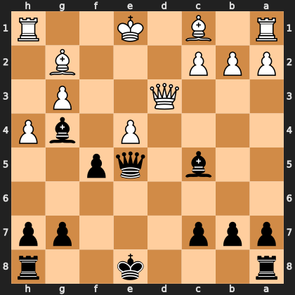

# Puzzle p09bbccfed0

<!-- puzzle-id: p09bbccfed0 | frame: original | fen: r3k2r/ppp3pp/8/2b1qp2/4P1bP/3Q2P1/PPP3B1/R1B1K2R b KQkq - 1 14 | type: allowed_tactic -->

**Black to move.** You want to play **e8g8**. What is wrong with it?



```
    h g f e d c b a
  1 R . . K . B . R 1
  2 . B . . . P P P 2
  3 . P . . Q . . . 3
  4 P b . P . . . . 4
  5 . . p q . b . . 5
  6 . . . . . . . . 6
  7 p p . . . p p p 7
  8 r . . k . . . r 8
    h g f e d c b a
```

Board is drawn from Black's side. Uppercase is White, lowercase is Black.

FEN: `r3k2r/ppp3pp/8/2b1qp2/4P1bP/3Q2P1/PPP3B1/R1B1K2R b KQkq - 1 14`

Status: unattempted | attempts: 0

<details><summary>Answer</summary>

After **e8g8**, the refutation is `Qc4+` (d3c4).

Play instead: `Rd8` (a8d8)

Eval before: -8.86
Win probability lost: 19.6
Refute depth: 6

Source: https://www.chess.com/game/live/171795040624, move 14

</details>
