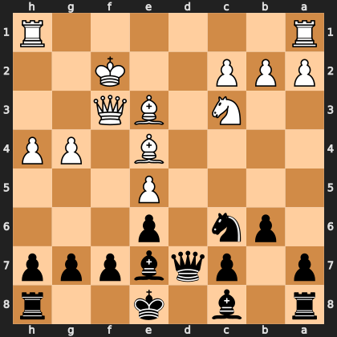

# Puzzle p119ae7e0c2

<!-- puzzle-id: p119ae7e0c2 | frame: original | fen: r1b1k2r/p1pqbppp/1pn1p3/4P3/4B1PP/2N1BQ2/PPP2K2/R6R b kq - 3 14 | type: missed_tactic -->

**Black to move.** Find the best move.



```
    h g f e d c b a
  1 R . . . . . . R 1
  2 . . K . . P P P 2
  3 . . Q B . N . . 3
  4 P P . B . . . . 4
  5 . . . P . . . . 5
  6 . . . p . n p . 6
  7 p p p b q p . p 7
  8 r . . k . b . r 8
    h g f e d c b a
```

Board is drawn from Black's side. Uppercase is White, lowercase is Black.

FEN: `r1b1k2r/p1pqbppp/1pn1p3/4P3/4B1PP/2N1BQ2/PPP2K2/R6R b kq - 3 14`

Status: unattempted | attempts: 0

<details><summary>Answer</summary>

Best move: `Nxe5` (c6e5)

You played: `c8b7`

Eval before: -1.37
Win probability lost: 34.7
Refute depth: 8

Source: https://www.chess.com/game/daily/1001249768, move 14

</details>
