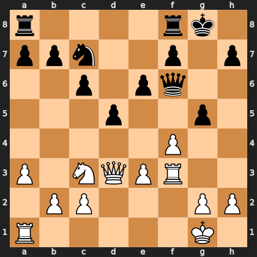

# Puzzle p2017d672f6

<!-- puzzle-id: p2017d672f6 | frame: original | fen: r4rk1/ppn2p1p/2p1pq2/3p2p1/5P2/P1NQPR2/1PP3PP/R5K1 w - - 0 19 | type: brilliant_sacrifice -->

**White to move.** Find the best move.



```
    a b c d e f g h
  8 r . . . . r k . 8
  7 p p n . . p . p 7
  6 . . p . p q . . 6
  5 . . . p . . p . 5
  4 . . . . . P . . 4
  3 P . N Q P R . . 3
  2 . P P . . . P P 2
  1 R . . . . . K . 1
    a b c d e f g h
```

Board is drawn from White's side. Uppercase is White, lowercase is Black.

FEN: `r4rk1/ppn2p1p/2p1pq2/3p2p1/5P2/P1NQPR2/1PP3PP/R5K1 w - - 0 19`

Status: unattempted | attempts: 0

<details><summary>Answer</summary>

Best move: `fxg5` (f4g5)

You played: `f3h3`

Eval before: +1.15
Win probability lost: 9.6
Refute depth: 7

Source: https://www.chess.com/game/live/171886517316, move 19

</details>
