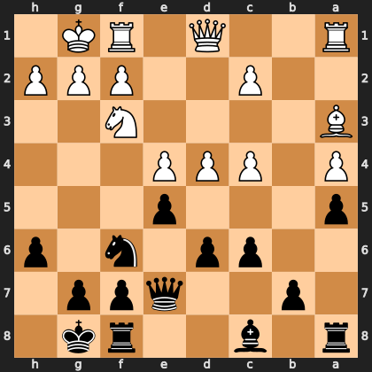

# Puzzle p458f57847a

<!-- puzzle-id: p458f57847a | frame: original | fen: r1b2rk1/1p2qpp1/2pp1n1p/p3p3/P1PPP3/B4N2/2P2PPP/R2Q1RK1 b - - 0 13 | type: missed_tactic -->

**Black to move.** Find the best move.



```
    h g f e d c b a
  1 . K R . Q . . R 1
  2 P P P . . P . . 2
  3 . . N . . . . B 3
  4 . . . P P P . P 4
  5 . . . p . . . p 5
  6 p . n . p p . . 6
  7 . p p q . . p . 7
  8 . k r . . b . r 8
    h g f e d c b a
```

Board is drawn from Black's side. Uppercase is White, lowercase is Black.

FEN: `r1b2rk1/1p2qpp1/2pp1n1p/p3p3/P1PPP3/B4N2/2P2PPP/R2Q1RK1 b - - 0 13`

Status: unattempted | attempts: 0

<details><summary>Answer</summary>

Best move: `c5` (c6c5)

You played: `e5d4`

Eval before: -0.39
Win probability lost: 19.1
Refute depth: 5

Source: https://www.chess.com/game/live/171808612292, move 13

</details>
