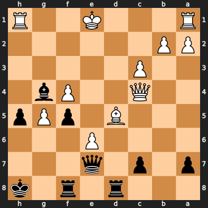

# Puzzle pef14d56c4c

<!-- puzzle-id: pef14d56c4c | frame: original | fen: 3r1r1k/p1p1q3/4P3/3B1pPp/2Q2Pb1/2P5/PP6/R3K2R b KQ - 0 23 | type: brilliant_sacrifice -->

**Black to move.** Find the best move.



```
    h g f e d c b a
  1 R . . K . . . R 1
  2 . . . . . . P P 2
  3 . . . . . P . . 3
  4 . b P . . Q . . 4
  5 p P p . B . . . 5
  6 . . . P . . . . 6
  7 . . . q . p . p 7
  8 k . r . r . . . 8
    h g f e d c b a
```

Board is drawn from Black's side. Uppercase is White, lowercase is Black.

FEN: `3r1r1k/p1p1q3/4P3/3B1pPp/2Q2Pb1/2P5/PP6/R3K2R b KQ - 0 23`

Status: unattempted | attempts: 0

<details><summary>Answer</summary>

Best move: `c6` (c7c6)

You played: `h8g7`

Eval before: +0.48
Win probability lost: 21.6
Refute depth: 6

Source: https://www.chess.com/game/live/171795040624, move 23

</details>
