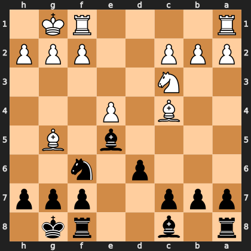

# Puzzle pff1253ec13

<!-- puzzle-id: pff1253ec13 | frame: original | fen: r1b2rk1/ppp2ppp/3p1n2/4b1B1/2B1P3/2N5/PPP2PPP/R4RK1 b - - 3 11 | type: missed_tactic -->

**Black to move.** Find the best move.



```
    h g f e d c b a
  1 . K R . . . . R 1
  2 P P P . . P P P 2
  3 . . . . . N . . 3
  4 . . . P . B . . 4
  5 . B . b . . . . 5
  6 . . n . p . . . 6
  7 p p p . . p p p 7
  8 . k r . . b . r 8
    h g f e d c b a
```

Board is drawn from Black's side. Uppercase is White, lowercase is Black.

FEN: `r1b2rk1/ppp2ppp/3p1n2/4b1B1/2B1P3/2N5/PPP2PPP/R4RK1 b - - 3 11`

Status: unattempted | attempts: 0

<details><summary>Answer</summary>

Best move: `Bxc3` (e5c3)

You played: `c8e6`

Eval before: -2.11
Win probability lost: 15.8
Refute depth: 4

Source: https://www.chess.com/game/live/171794224796, move 11

</details>
