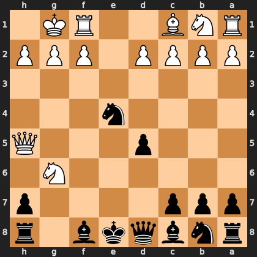

# Puzzle p3606227117

<!-- puzzle-id: p3606227117 | frame: original | fen: rnbqkb1r/ppp4p/6N1/3p3Q/4n3/8/PPPP1PPP/RNB2RK1 b - - 0 8 | type: missed_tactic -->

**Black to move.** Find the best move.



```
    h g f e d c b a
  1 . K R . . B N R 1
  2 P P P . P P P P 2
  3 . . . . . . . . 3
  4 . . . n . . . . 4
  5 Q . . . p . . . 5
  6 . N . . . . . . 6
  7 p . . . . p p p 7
  8 r . b k q b n r 8
    h g f e d c b a
```

Board is drawn from Black's side. Uppercase is White, lowercase is Black.

FEN: `rnbqkb1r/ppp4p/6N1/3p3Q/4n3/8/PPPP1PPP/RNB2RK1 b - - 0 8`

Status: unattempted | attempts: 0

<details><summary>Answer</summary>

Best move: `hxg6` (h7g6)

You played: `h8g8`

Eval before: -0.45
Win probability lost: 31.6
Refute depth: 4

Source: https://www.chess.com/game/live/172130857754, move 8

</details>
