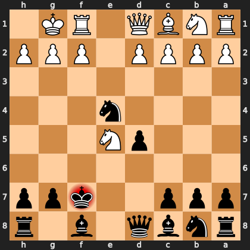

# Puzzle p7f2caa6280

<!-- puzzle-id: p7f2caa6280 | frame: original | fen: rnbq1b1r/ppp2kpp/8/3pN3/4n3/8/PPPP1PPP/RNBQ1RK1 b - - 0 6 | type: allowed_tactic -->

**Black to move.** You want to play **f7e8**. What is wrong with it?



```
    h g f e d c b a
  1 . K R . Q B N R 1
  2 P P P . P P P P 2
  3 . . . . . . . . 3
  4 . . . n . . . . 4
  5 . . . N p . . . 5
  6 . . . . . . . . 6
  7 p p k . . p p p 7
  8 r . b . q b n r 8
    h g f e d c b a
```

Board is drawn from Black's side. Uppercase is White, lowercase is Black.

FEN: `rnbq1b1r/ppp2kpp/8/3pN3/4n3/8/PPPP1PPP/RNBQ1RK1 b - - 0 6`

Status: unattempted | attempts: 0

<details><summary>Answer</summary>

After **f7e8**, the refutation is `Qh5+` (d1h5).

Play instead: `Kg8` (f7g8)

Eval before: -3.34
Win probability lost: 21.9
Refute depth: 6

Source: https://www.chess.com/game/live/172130857754, move 6

</details>
