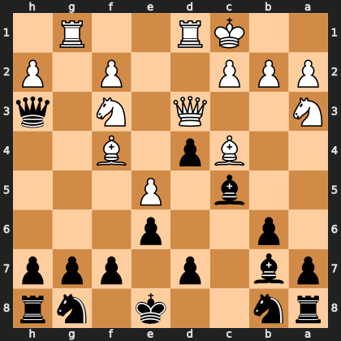

# Puzzle p9ca262a924

<!-- puzzle-id: p9ca262a924 | frame: original | fen: rn2k1nr/pb1p1ppp/1p2p3/2b1P3/2Bp1B2/N2Q1N1q/PPP2P1P/2KR2R1 b kq - 3 10 | type: missed_tactic -->

**Black to move.** Find the best move.



```
    h g f e d c b a
  1 . R . . R K . . 1
  2 P . P . . P P P 2
  3 q . N . Q . . N 3
  4 . . B . p B . . 4
  5 . . . P . b . . 5
  6 . . . p . . p . 6
  7 p p p . p . b p 7
  8 r n . k . . n r 8
    h g f e d c b a
```

Board is drawn from Black's side. Uppercase is White, lowercase is Black.

FEN: `rn2k1nr/pb1p1ppp/1p2p3/2b1P3/2Bp1B2/N2Q1N1q/PPP2P1P/2KR2R1 b kq - 3 10`

Status: unattempted | attempts: 0

<details><summary>Answer</summary>

Best move: `Qxf3` (h3f3)

You played: `g8e7`

Eval before: -4.25
Win probability lost: 14.4
Refute depth: 3

Source: https://www.chess.com/game/live/172147882786, move 10

</details>
