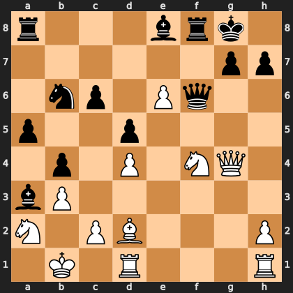

# Puzzle pb4523e0d8f

<!-- puzzle-id: pb4523e0d8f | frame: original | fen: r3brk1/6pp/1np1Pq2/p2p4/1p1P1NQ1/bP6/N1PB3P/1K1R3R w - - 1 23 | type: brilliant_sacrifice -->

**White to move.** Find the best move.



```
    a b c d e f g h
  8 r . . . b r k . 8
  7 . . . . . . p p 7
  6 . n p . P q . . 6
  5 p . . p . . . . 5
  4 . p . P . N Q . 4
  3 b P . . . . . . 3
  2 N . P B . . . P 2
  1 . K . R . . . R 1
    a b c d e f g h
```

Board is drawn from White's side. Uppercase is White, lowercase is Black.

FEN: `r3brk1/6pp/1np1Pq2/p2p4/1p1P1NQ1/bP6/N1PB3P/1K1R3R w - - 1 23`

Status: unattempted | attempts: 0

<details><summary>Answer</summary>

Best move: `Rhf1` (h1f1)

You played: `c2c3`

Eval before: -1.05
Win probability lost: 28.3
Refute depth: 5

Source: https://www.chess.com/game/live/172128408076, move 23

</details>
