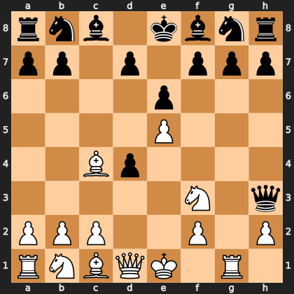

# Puzzle pdad311aa09

<!-- puzzle-id: pdad311aa09 | frame: original | fen: rnb1kbnr/pp1p1ppp/4p3/4P3/2Bp4/5N1q/PPP2P1P/RNBQK1R1 w Qkq - 0 7 | type: missed_tactic -->

**White to move.** Find the best move.



```
    a b c d e f g h
  8 r n b . k b n r 8
  7 p p . p . p p p 7
  6 . . . . p . . . 6
  5 . . . . P . . . 5
  4 . . B p . . . . 4
  3 . . . . . N . q 3
  2 P P P . . P . P 2
  1 R N B Q K . R . 1
    a b c d e f g h
```

Board is drawn from White's side. Uppercase is White, lowercase is Black.

FEN: `rnb1kbnr/pp1p1ppp/4p3/4P3/2Bp4/5N1q/PPP2P1P/RNBQK1R1 w Qkq - 0 7`

Status: unattempted | attempts: 0

<details><summary>Answer</summary>

Best move: `Bf1` (c4f1)

You played: `d1d3`

Eval before: +1.81
Win probability lost: 27.6
Refute depth: 4

Source: https://www.chess.com/game/live/172147882786, move 7

</details>
