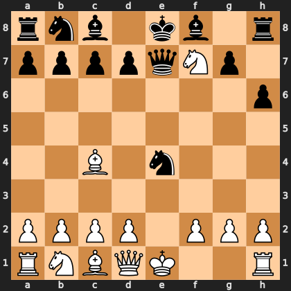

# Puzzle p4521fcfeaa

<!-- puzzle-id: p4521fcfeaa | frame: original | fen: rnb1kb1r/ppppqNp1/7p/8/2B1n3/8/PPPP1PPP/RNBQK2R w KQkq - 1 6 | type: missed_tactic -->

**White to move.** Find the best move.



```
    a b c d e f g h
  8 r n b . k b . r 8
  7 p p p p q N p . 7
  6 . . . . . . . p 6
  5 . . . . . . . . 5
  4 . . B . n . . . 4
  3 . . . . . . . . 3
  2 P P P P . P P P 2
  1 R N B Q K . . R 1
    a b c d e f g h
```

Board is drawn from White's side. Uppercase is White, lowercase is Black.

FEN: `rnb1kb1r/ppppqNp1/7p/8/2B1n3/8/PPPP1PPP/RNBQK2R w KQkq - 1 6`

Status: unattempted | attempts: 0

<details><summary>Answer</summary>

Best move: `O-O` (e1g1)

You played: `d1e2`

Eval before: +5.44
Win probability lost: 15.3
Refute depth: 4

Source: https://www.chess.com/game/live/172162795888, move 6

</details>
