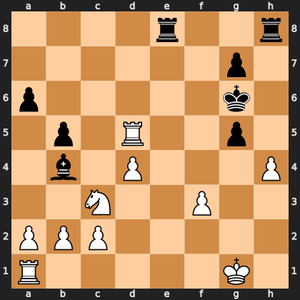

# Puzzle p5e6b8600a0

<!-- puzzle-id: p5e6b8600a0 | frame: original | fen: 4r2r/6p1/p5k1/1p1R2p1/1b1P3P/2N2P2/PPP5/R5K1 w - - 0 25 | type: missed_tactic -->

**White to move.** Find the best move.



```
    a b c d e f g h
  8 . . . . r . . r 8
  7 . . . . . . p . 7
  6 p . . . . . k . 6
  5 . p . R . . p . 5
  4 . b . P . . . P 4
  3 . . N . . P . . 3
  2 P P P . . . . . 2
  1 R . . . . . K . 1
    a b c d e f g h
```

Board is drawn from White's side. Uppercase is White, lowercase is Black.

FEN: `4r2r/6p1/p5k1/1p1R2p1/1b1P3P/2N2P2/PPP5/R5K1 w - - 0 25`

Status: unattempted | attempts: 0

<details><summary>Answer</summary>

Best move: `Rxg5+` (d5g5)

You played: `h4g5`

Eval before: +3.78
Win probability lost: 30.1
Refute depth: 3

Source: https://www.chess.com/game/live/172204968774, move 25

</details>
