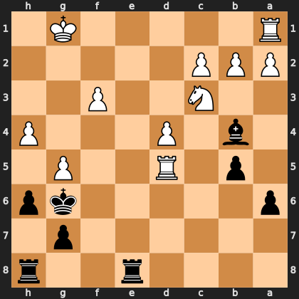

# Puzzle p78bc33ea87

<!-- puzzle-id: p78bc33ea87 | frame: original | fen: 4r2r/6p1/p5kp/1p1R2P1/1b1P3P/2N2P2/PPP5/R5K1 b - - 0 24 | type: missed_tactic -->

**Black to move.** Find the best move.



```
    h g f e d c b a
  1 . K . . . . . R 1
  2 . . . . . P P P 2
  3 . . P . . N . . 3
  4 P . . . P . b . 4
  5 . P . . R . p . 5
  6 p k . . . . . p 6
  7 . p . . . . . . 7
  8 r . . r . . . . 8
    h g f e d c b a
```

Board is drawn from Black's side. Uppercase is White, lowercase is Black.

FEN: `4r2r/6p1/p5kp/1p1R2P1/1b1P3P/2N2P2/PPP5/R5K1 b - - 0 24`

Status: unattempted | attempts: 0

<details><summary>Answer</summary>

Best move: `Bxc3` (b4c3)

You played: `h6g5`

Eval before: +1.69
Win probability lost: 15.0
Refute depth: 6

Source: https://www.chess.com/game/live/172204968774, move 24

</details>
