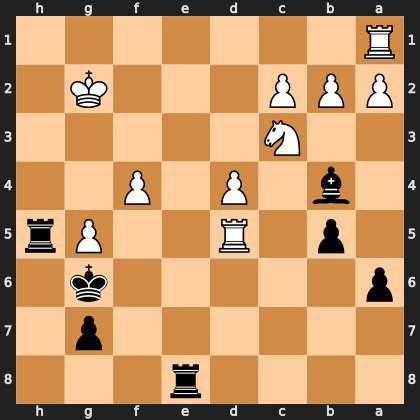

# Puzzle p8943b1bb40

<!-- puzzle-id: p8943b1bb40 | frame: original | fen: 4r3/6p1/p5k1/1p1R2Pr/1b1P1P2/2N5/PPP3K1/R7 b - - 0 27 | type: missed_tactic -->

**Black to move.** Find the best move.



```
    h g f e d c b a
  1 . . . . . . . R 1
  2 . K . . . P P P 2
  3 . . . . . N . . 3
  4 . . P . P . b . 4
  5 r P . . R . p . 5
  6 . k . . . . . p 6
  7 . p . . . . . . 7
  8 . . . r . . . . 8
    h g f e d c b a
```

Board is drawn from Black's side. Uppercase is White, lowercase is Black.

FEN: `4r3/6p1/p5k1/1p1R2Pr/1b1P1P2/2N5/PPP3K1/R7 b - - 0 27`

Status: unattempted | attempts: 0

<details><summary>Answer</summary>

Best move: `Bxc3` (b4c3)

You played: `e8e3`

Eval before: +2.60
Win probability lost: 12.2
Refute depth: 4

Source: https://www.chess.com/game/live/172204968774, move 27

</details>
