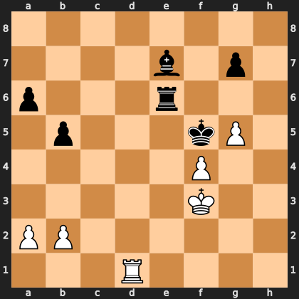

# Puzzle pd76cc36964

<!-- puzzle-id: pd76cc36964 | frame: original | fen: 8/4b1p1/p3r3/1p3kP1/5P2/5K2/PP6/3R4 w - - 2 40 | type: missed_tactic -->

**White to move.** Find the best move.



```
    a b c d e f g h
  8 . . . . . . . . 8
  7 . . . . b . p . 7
  6 p . . . r . . . 6
  5 . p . . . k P . 5
  4 . . . . . P . . 4
  3 . . . . . K . . 3
  2 P P . . . . . . 2
  1 . . . R . . . . 1
    a b c d e f g h
```

Board is drawn from White's side. Uppercase is White, lowercase is Black.

FEN: `8/4b1p1/p3r3/1p3kP1/5P2/5K2/PP6/3R4 w - - 2 40`

Status: unattempted | attempts: 0

<details><summary>Answer</summary>

Best move: `Rd5+` (d1d5)

You played: `d1d2`

Eval before: +4.01
Win probability lost: 67.9
Refute depth: 5

Source: https://www.chess.com/game/live/172204968774, move 40

</details>
