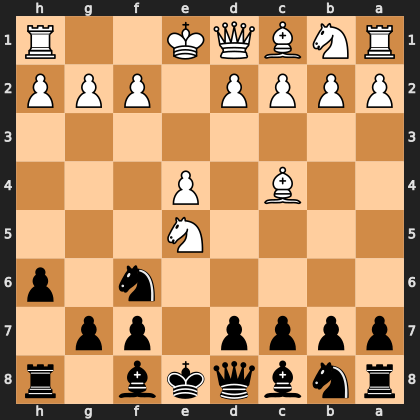

# Puzzle pef4f94cd3a

<!-- puzzle-id: pef4f94cd3a | frame: original | fen: rnbqkb1r/pppp1pp1/5n1p/4N3/2B1P3/8/PPPP1PPP/RNBQK2R b KQkq - 0 4 | type: missed_tactic -->

**Black to move.** Find the best move.



```
    h g f e d c b a
  1 R . . K Q B N R 1
  2 P P P . P P P P 2
  3 . . . . . . . . 3
  4 . . . P . B . . 4
  5 . . . N . . . . 5
  6 p . n . . . . . 6
  7 . p p . p p p p 7
  8 r . b k q b n r 8
    h g f e d c b a
```

Board is drawn from Black's side. Uppercase is White, lowercase is Black.

FEN: `rnbqkb1r/pppp1pp1/5n1p/4N3/2B1P3/8/PPPP1PPP/RNBQK2R b KQkq - 0 4`

Status: unattempted | attempts: 0

<details><summary>Answer</summary>

Best move: `d5` (d7d5)

You played: `f6e4`

Eval before: +2.01
Win probability lost: 22.3
Refute depth: 4

Source: https://www.chess.com/game/live/172162795888, move 4

</details>
