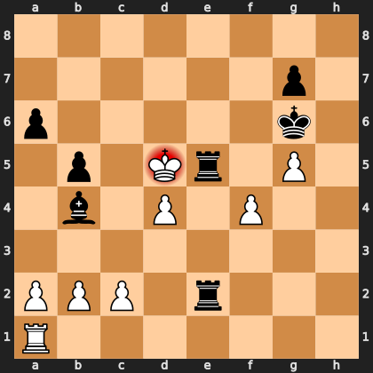

# Puzzle pf9b0c8cb82

<!-- puzzle-id: pf9b0c8cb82 | frame: original | fen: 8/6p1/p5k1/1p1Kr1P1/1b1P1P2/8/PPP1r3/R7 w - - 0 34 | type: missed_tactic -->

**White to move.** Find the best move.



```
    a b c d e f g h
  8 . . . . . . . . 8
  7 . . . . . . p . 7
  6 p . . . . . k . 6
  5 . p . K r . P . 5
  4 . b . P . P . . 4
  3 . . . . . . . . 3
  2 P P P . r . . . 2
  1 R . . . . . . . 1
    a b c d e f g h
```

Board is drawn from White's side. Uppercase is White, lowercase is Black.

FEN: `8/6p1/p5k1/1p1Kr1P1/1b1P1P2/8/PPP1r3/R7 w - - 0 34`

Status: unattempted | attempts: 0

<details><summary>Answer</summary>

Best move: `fxe5` (f4e5)

You played: `d4e5`

Eval before: -1.48
Win probability lost: 18.1
Refute depth: 5

Source: https://www.chess.com/game/live/172204968774, move 34

</details>
