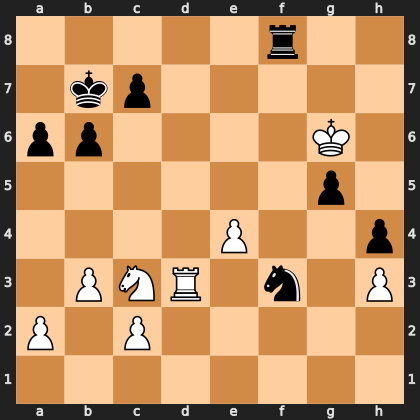

# Puzzle p17d596f689

<!-- puzzle-id: p17d596f689 | frame: original | fen: 5r2/1kp5/pp4K1/6p1/4P2p/1PNR1n1P/P1P5/8 w - - 5 35 | type: allowed_tactic -->

**White to move.** You want to play **g6h5**. What is wrong with it?



```
    a b c d e f g h
  8 . . . . . r . . 8
  7 . k p . . . . . 7
  6 p p . . . . K . 6
  5 . . . . . . p . 5
  4 . . . . P . . p 4
  3 . P N R . n . P 3
  2 P . P . . . . . 2
  1 . . . . . . . . 1
    a b c d e f g h
```

Board is drawn from White's side. Uppercase is White, lowercase is Black.

FEN: `5r2/1kp5/pp4K1/6p1/4P2p/1PNR1n1P/P1P5/8 w - - 5 35`

Status: unattempted | attempts: 0

<details><summary>Answer</summary>

After **g6h5**, the refutation is `Rh8+` (f8h8).

Play instead: `Kg7` (g6g7)

Eval before: +3.35
Win probability lost: 46.8
Refute depth: 7

Source: https://www.chess.com/game/live/172239094826, move 35

</details>
