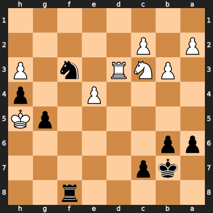

# Puzzle p7dd89e3777

<!-- puzzle-id: p7dd89e3777 | frame: original | fen: 5r2/1kp5/pp6/6pK/4P2p/1PNR1n1P/P1P5/8 b - - 6 35 | type: missed_tactic -->

**Black to move.** Find the best move.



```
    h g f e d c b a
  1 . . . . . . . . 1
  2 . . . . . P . P 2
  3 P . n . R N P . 3
  4 p . . P . . . . 4
  5 K p . . . . . . 5
  6 . . . . . . p p 6
  7 . . . . . p k . 7
  8 . . r . . . . . 8
    h g f e d c b a
```

Board is drawn from Black's side. Uppercase is White, lowercase is Black.

FEN: `5r2/1kp5/pp6/6pK/4P2p/1PNR1n1P/P1P5/8 b - - 6 35`

Status: unattempted | attempts: 0

<details><summary>Answer</summary>

Best move: `Rh8+` (f8h8)

You played: `b6b5`

Eval before: -2.22
Win probability lost: 22.9
Refute depth: 7

Source: https://www.chess.com/game/live/172239094826, move 35

</details>
