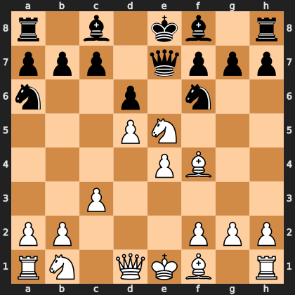

# Puzzle p1895a144b3

<!-- puzzle-id: p1895a144b3 | frame: original | fen: r1b1kb1r/ppp1qppp/n2p1n2/3PN3/4PB2/2P5/PP3PPP/RN1QKB1R w KQkq - 0 8 | type: missed_tactic -->

**White to move.** Find the best move.



```
    a b c d e f g h
  8 r . b . k b . r 8
  7 p p p . q p p p 7
  6 n . . p . n . . 6
  5 . . . P N . . . 5
  4 . . . . P B . . 4
  3 . . P . . . . . 3
  2 P P . . . P P P 2
  1 R N . Q K B . R 1
    a b c d e f g h
```

Board is drawn from White's side. Uppercase is White, lowercase is Black.

FEN: `r1b1kb1r/ppp1qppp/n2p1n2/3PN3/4PB2/2P5/PP3PPP/RN1QKB1R w KQkq - 0 8`

Status: unattempted | attempts: 0

<details><summary>Answer</summary>

Best move: `Bxa6` (f1a6)

You played: `e5f3`

Eval before: +1.55
Win probability lost: 23.4
Refute depth: 4

Source: https://www.chess.com/game/live/172258195246, move 8

</details>
