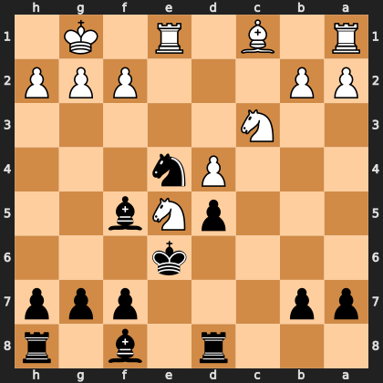

# Puzzle p45a9cf6ba5

<!-- puzzle-id: p45a9cf6ba5 | frame: original | fen: 3r1b1r/pp3ppp/4k3/3pNb2/3Pn3/2N5/PP3PPP/R1B1R1K1 b - - 5 14 | type: missed_tactic -->

**Black to move.** Find the best move.



```
    h g f e d c b a
  1 . K . R . B . R 1
  2 P P P . . . P P 2
  3 . . . . . N . . 3
  4 . . . n P . . . 4
  5 . . b N p . . . 5
  6 . . . k . . . . 6
  7 p p p . . . p p 7
  8 r . b . r . . . 8
    h g f e d c b a
```

Board is drawn from Black's side. Uppercase is White, lowercase is Black.

FEN: `3r1b1r/pp3ppp/4k3/3pNb2/3Pn3/2N5/PP3PPP/R1B1R1K1 b - - 5 14`

Status: unattempted | attempts: 0

<details><summary>Answer</summary>

Best move: `f6` (f7f6)

You played: `e4c3`

Eval before: -0.21
Win probability lost: 16.4
Refute depth: 7

Source: https://www.chess.com/game/live/172291417954, move 14

</details>
