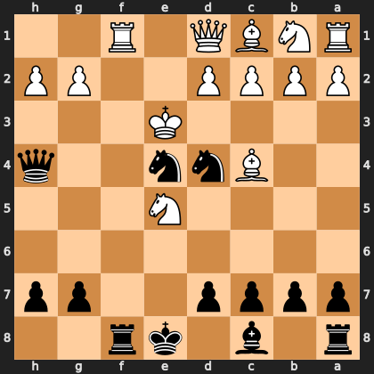

# Puzzle p5fcace3e7b

<!-- puzzle-id: p5fcace3e7b | frame: original | fen: r1b1kr2/pppp2pp/8/4N3/2Bnn2q/4K3/PPPP2PP/RNBQ1R2 b q - 0 10 | type: missed_tactic -->

**Black to move.** Find the best move.



```
    h g f e d c b a
  1 . . R . Q B N R 1
  2 P P . . P P P P 2
  3 . . . K . . . . 3
  4 q . . n n B . . 4
  5 . . . N . . . . 5
  6 . . . . . . . . 6
  7 p p . . p p p p 7
  8 . . r k . b . r 8
    h g f e d c b a
```

Board is drawn from Black's side. Uppercase is White, lowercase is Black.

FEN: `r1b1kr2/pppp2pp/8/4N3/2Bnn2q/4K3/PPPP2PP/RNBQ1R2 b q - 0 10`

Status: unattempted | attempts: 0

<details><summary>Answer</summary>

Best move: `Nf2` (e4f2)

You played: `f8f1`

Eval before: -6.02
Win probability lost: 21.4
Refute depth: 3

Source: https://www.chess.com/game/live/172302205862, move 10

</details>
