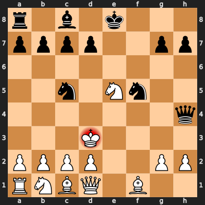

# Puzzle pa2ed4b2ae3

<!-- puzzle-id: pa2ed4b2ae3 | frame: original | fen: r1b1k3/pppp2pp/8/2n1Nn2/7q/3K4/PPPP2PP/RNBQ1B2 w q - 3 13 | type: allowed_tactic -->

**White to move.** You want to play **d3c3**. What is wrong with it?



```
    a b c d e f g h
  8 r . b . k . . . 8
  7 p p p p . . p p 7
  6 . . . . . . . . 6
  5 . . n . N n . . 5
  4 . . . . . . . q 4
  3 . . . K . . . . 3
  2 P P P P . . P P 2
  1 R N B Q . B . . 1
    a b c d e f g h
```

Board is drawn from White's side. Uppercase is White, lowercase is Black.

FEN: `r1b1k3/pppp2pp/8/2n1Nn2/7q/3K4/PPPP2PP/RNBQ1B2 w q - 3 13`

Status: unattempted | attempts: 0

<details><summary>Answer</summary>

After **d3c3**, the refutation is `Qd4#` (h4d4).

Play instead: `Ke2` (d3e2)

Eval before: -3.26
Win probability lost: 20.7
Refute depth: 3

Source: https://www.chess.com/game/live/172302205862, move 13

</details>
