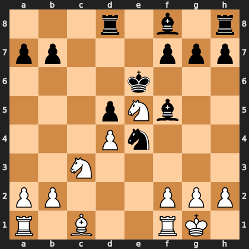

# Puzzle pa5929c7913

<!-- puzzle-id: pa5929c7913 | frame: original | fen: 3r1b1r/pp3ppp/4k3/3pNb2/3Pn3/2N5/PP3PPP/R1B2RK1 w - - 4 14 | type: missed_tactic -->

**White to move.** Find the best move.



```
    a b c d e f g h
  8 . . . r . b . r 8
  7 p p . . . p p p 7
  6 . . . . k . . . 6
  5 . . . p N b . . 5
  4 . . . P n . . . 4
  3 . . N . . . . . 3
  2 P P . . . P P P 2
  1 R . B . . R K . 1
    a b c d e f g h
```

Board is drawn from White's side. Uppercase is White, lowercase is Black.

FEN: `3r1b1r/pp3ppp/4k3/3pNb2/3Pn3/2N5/PP3PPP/R1B2RK1 w - - 4 14`

Status: unattempted | attempts: 0

<details><summary>Answer</summary>

Best move: `g4` (g2g4)

You played: `f1e1`

Eval before: +1.39
Win probability lost: 14.5
Refute depth: 3

Source: https://www.chess.com/game/live/172291417954, move 14

</details>
