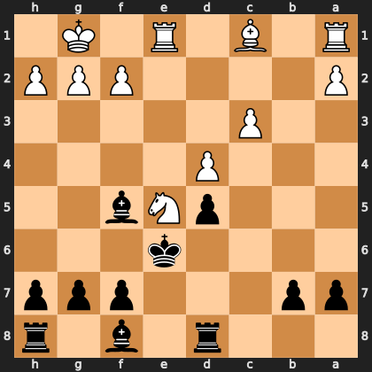

# Puzzle pc4b5f93f17

<!-- puzzle-id: pc4b5f93f17 | frame: original | fen: 3r1b1r/pp3ppp/4k3/3pNb2/3P4/2P5/P4PPP/R1B1R1K1 b - - 0 15 | type: allowed_tactic -->

**Black to move.** You want to play **f7f6**. What is wrong with it?



```
    h g f e d c b a
  1 . K . R . B . R 1
  2 P P P . . . . P 2
  3 . . . . . P . . 3
  4 . . . . P . . . 4
  5 . . b N p . . . 5
  6 . . . k . . . . 6
  7 p p p . . . p p 7
  8 r . b . r . . . 8
    h g f e d c b a
```

Board is drawn from Black's side. Uppercase is White, lowercase is Black.

FEN: `3r1b1r/pp3ppp/4k3/3pNb2/3P4/2P5/P4PPP/R1B1R1K1 b - - 0 15`

Status: unattempted | attempts: 0

<details><summary>Answer</summary>

After **f7f6**, the refutation is `Ng6+` (e5g6).

Play instead: `Bd6` (f8d6)

Eval before: +1.14
Win probability lost: 18.6
Refute depth: 6

Source: https://www.chess.com/game/live/172291417954, move 15

</details>
