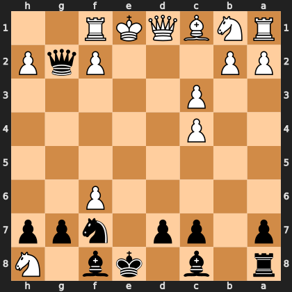

# Puzzle pcaa6357443

<!-- puzzle-id: pcaa6357443 | frame: original | fen: r1b1kb1N/p1pp1npp/5P2/8/2P5/2P5/PP3PqP/RNBQKR2 b Qq - 0 12 | type: allowed_tactic -->

**Black to move.** You want to play **g7f6**. What is wrong with it?



```
    h g f e d c b a
  1 . . R K Q B N R 1
  2 P q P . . . P P 2
  3 . . . . . P . . 3
  4 . . . . . P . . 4
  5 . . . . . . . . 5
  6 . . P . . . . . 6
  7 p p n . p p . p 7
  8 N . b k . b . r 8
    h g f e d c b a
```

Board is drawn from Black's side. Uppercase is White, lowercase is Black.

FEN: `r1b1kb1N/p1pp1npp/5P2/8/2P5/2P5/PP3PqP/RNBQKR2 b Qq - 0 12`

Status: unattempted | attempts: 0

<details><summary>Answer</summary>

After **g7f6**, the refutation is `Nxf7` (h8f7).

Play instead: `Nxh8` (f7h8)

Eval before: +3.40
Win probability lost: 9.5
Refute depth: 3

Source: https://www.chess.com/game/daily/1003439434, move 12

</details>
