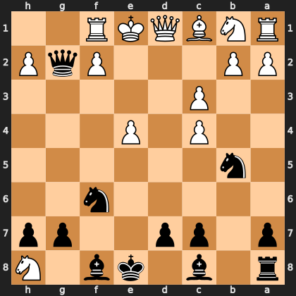

# Puzzle pff99eb3916

<!-- puzzle-id: pff99eb3916 | frame: original | fen: r1b1kb1N/p1pp2pp/5n2/1n6/2P1P3/2P5/PP3PqP/RNBQKR2 b Qq - 0 10 | type: missed_tactic -->

**Black to move.** Find the best move.



```
    h g f e d c b a
  1 . . R K Q B N R 1
  2 P q P . . . P P 2
  3 . . . . . P . . 3
  4 . . . P . P . . 4
  5 . . . . . . n . 5
  6 . . n . . . . . 6
  7 p p . . p p . p 7
  8 N . b k . b . r 8
    h g f e d c b a
```

Board is drawn from Black's side. Uppercase is White, lowercase is Black.

FEN: `r1b1kb1N/p1pp2pp/5n2/1n6/2P1P3/2P5/PP3PqP/RNBQKR2 b Qq - 0 10`

Status: unattempted | attempts: 0

<details><summary>Answer</summary>

Best move: `Qxe4+` (g2e4)

You played: `b5d6`

Eval before: +0.00
Win probability lost: 19.9
Refute depth: 3

Source: https://www.chess.com/game/daily/1003439434, move 10

</details>
