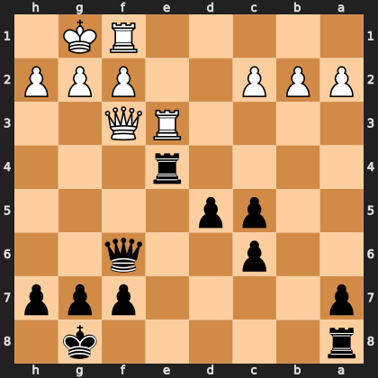

# Puzzle p2ef282d467

<!-- puzzle-id: p2ef282d467 | frame: original | fen: r5k1/p4ppp/2p2q2/2pp4/4r3/4RQ2/PPP2PPP/5RK1 b - - 1 18 | type: allowed_tactic -->

**Black to move.** You want to play **a8e8**. What is wrong with it?



```
    h g f e d c b a
  1 . K R . . . . . 1
  2 P P P . . P P P 2
  3 . . Q R . . . . 3
  4 . . . r . . . . 4
  5 . . . . p p . . 5
  6 . . q . . p . . 6
  7 p p p . . . . p 7
  8 . k . . . . . r 8
    h g f e d c b a
```

Board is drawn from Black's side. Uppercase is White, lowercase is Black.

FEN: `r5k1/p4ppp/2p2q2/2pp4/4r3/4RQ2/PPP2PPP/5RK1 b - - 1 18`

Status: unattempted | attempts: 0

<details><summary>Answer</summary>

After **a8e8**, the refutation is `Qxf6` (f3f6).

Play instead: `Qxf3` (f6f3)

Eval before: -1.50
Win probability lost: 9.7
Refute depth: 3

Source: https://www.chess.com/game/daily/1007135470, move 18

</details>
