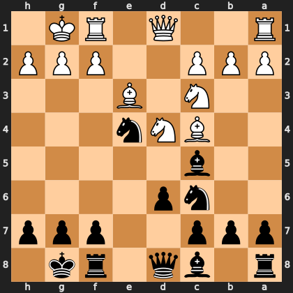

# Puzzle p4fcf7e2a3b

<!-- puzzle-id: p4fcf7e2a3b | frame: original | fen: r1bq1rk1/ppp2ppp/2np4/2b5/2BNn3/2N1B3/PPP2PPP/R2Q1RK1 b - - 1 9 | type: missed_tactic -->

**Black to move.** Find the best move.



```
    h g f e d c b a
  1 . K R . Q . . R 1
  2 P P P . . P P P 2
  3 . . . B . N . . 3
  4 . . . n N B . . 4
  5 . . . . . b . . 5
  6 . . . . p n . . 6
  7 p p p . . p p p 7
  8 . k r . q b . r 8
    h g f e d c b a
```

Board is drawn from Black's side. Uppercase is White, lowercase is Black.

FEN: `r1bq1rk1/ppp2ppp/2np4/2b5/2BNn3/2N1B3/PPP2PPP/R2Q1RK1 b - - 1 9`

Status: unattempted | attempts: 0

<details><summary>Answer</summary>

Best move: `Nxc3` (e4c3)

You played: `f8e8`

Eval before: -1.98
Win probability lost: 26.4
Refute depth: 7

Source: https://www.chess.com/game/daily/1007135470, move 9

</details>
