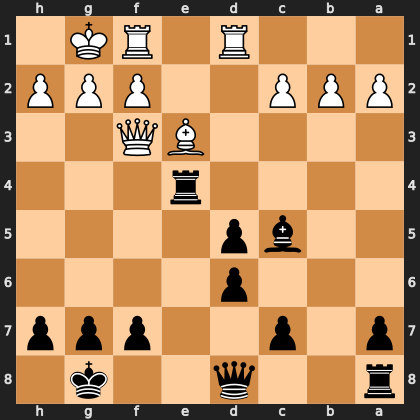

# Puzzle p5fe406e697

<!-- puzzle-id: p5fe406e697 | frame: original | fen: r2q2k1/p1p2ppp/3p4/2bp4/4r3/4BQ2/PPP2PPP/3R1RK1 b - - 1 15 | type: allowed_tactic -->

**Black to move.** You want to play **c7c6**. What is wrong with it?



```
    h g f e d c b a
  1 . K R . R . . . 1
  2 P P P . . P P P 2
  3 . . Q B . . . . 3
  4 . . . r . . . . 4
  5 . . . . p b . . 5
  6 . . . . p . . . 6
  7 p p p . . p . p 7
  8 . k . . q . . r 8
    h g f e d c b a
```

Board is drawn from Black's side. Uppercase is White, lowercase is Black.

FEN: `r2q2k1/p1p2ppp/3p4/2bp4/4r3/4BQ2/PPP2PPP/3R1RK1 b - - 1 15`

Status: unattempted | attempts: 0

<details><summary>Answer</summary>

After **c7c6**, the refutation is `Bxc5` (e3c5).

Play instead: `Bxe3` (c5e3)

Eval before: -1.38
Win probability lost: 8.9
Refute depth: 7

Source: https://www.chess.com/game/daily/1007135470, move 15

</details>
