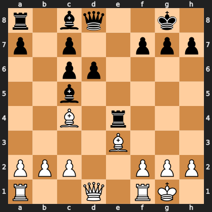

# Puzzle paaba98376c

<!-- puzzle-id: paaba98376c | frame: original | fen: r1bq2k1/p1p2ppp/2pp4/2b5/2B1r3/4B3/PPP2PPP/R2Q1RK1 w - - 0 12 | type: missed_tactic -->

**White to move.** Find the best move.



```
    a b c d e f g h
  8 r . b q . . k . 8
  7 p . p . . p p p 7
  6 . . p p . . . . 6
  5 . . b . . . . . 5
  4 . . B . r . . . 4
  3 . . . . B . . . 3
  2 P P P . . P P P 2
  1 R . . Q . R K . 1
    a b c d e f g h
```

Board is drawn from White's side. Uppercase is White, lowercase is Black.

FEN: `r1bq2k1/p1p2ppp/2pp4/2b5/2B1r3/4B3/PPP2PPP/R2Q1RK1 w - - 0 12`

Status: unattempted | attempts: 0

<details><summary>Answer</summary>

Best move: `Bxf7+` (c4f7)

You played: `c4b3`

Eval before: +2.91
Win probability lost: 39.4
Refute depth: 7

Source: https://www.chess.com/game/daily/1007135470, move 12

</details>
