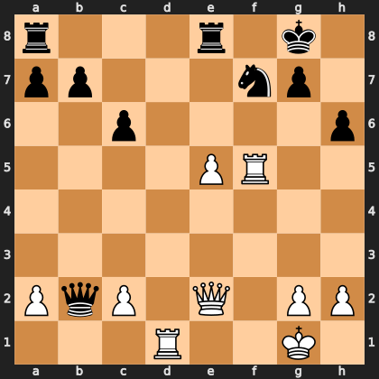

# Puzzle pb2582cbdb6

<!-- puzzle-id: pb2582cbdb6 | frame: original | fen: r3r1k1/pp3np1/2p4p/4PR2/8/8/PqP1Q1PP/3R2K1 w - - 0 23 | type: missed_tactic -->

**White to move.** Find the best move.



```
    a b c d e f g h
  8 r . . . r . k . 8
  7 p p . . . n p . 7
  6 . . p . . . . p 6
  5 . . . . P R . . 5
  4 . . . . . . . . 4
  3 . . . . . . . . 3
  2 P q P . Q . P P 2
  1 . . . R . . K . 1
    a b c d e f g h
```

Board is drawn from White's side. Uppercase is White, lowercase is Black.

FEN: `r3r1k1/pp3np1/2p4p/4PR2/8/8/PqP1Q1PP/3R2K1 w - - 0 23`

Status: unattempted | attempts: 0

<details><summary>Answer</summary>

Best move: `Rxf7` (f5f7)

You played: `e2h5`

Eval before: -0.96
Win probability lost: 27.5
Refute depth: 5

Source: https://www.chess.com/game/live/171750428224, move 23

</details>
