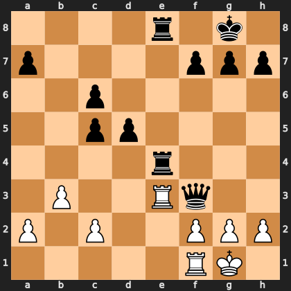

# Puzzle pb9528d5b67

<!-- puzzle-id: pb9528d5b67 | frame: original | fen: 4r1k1/p4ppp/2p5/2pp4/4r3/1P2Rq2/P1P2PPP/5RK1 w - - 0 20 | type: missed_tactic -->

**White to move.** Find the best move.



```
    a b c d e f g h
  8 . . . . r . k . 8
  7 p . . . . p p p 7
  6 . . p . . . . . 6
  5 . . p p . . . . 5
  4 . . . . r . . . 4
  3 . P . . R q . . 3
  2 P . P . . P P P 2
  1 . . . . . R K . 1
    a b c d e f g h
```

Board is drawn from White's side. Uppercase is White, lowercase is Black.

FEN: `4r1k1/p4ppp/2p5/2pp4/4r3/1P2Rq2/P1P2PPP/5RK1 w - - 0 20`

Status: unattempted | attempts: 0

<details><summary>Answer</summary>

Best move: `Rxf3` (e3f3)

You played: `g2f3`

Eval before: -1.41
Win probability lost: 21.0
Refute depth: 5

Source: https://www.chess.com/game/daily/1007135470, move 20

</details>
