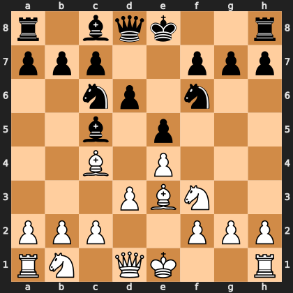

# Puzzle pcc7f76087e

<!-- puzzle-id: pcc7f76087e | frame: original | fen: r1bqk2r/ppp2ppp/2np1n2/2b1p3/2B1P3/3PBN2/PPP2PPP/RN1QK2R w KQkq - 0 6 | type: allowed_tactic -->

**White to move.** You want to play **e1g1**. What is wrong with it?



```
    a b c d e f g h
  8 r . b q k . . r 8
  7 p p p . . p p p 7
  6 . . n p . n . . 6
  5 . . b . p . . . 5
  4 . . B . P . . . 4
  3 . . . P B N . . 3
  2 P P P . . P P P 2
  1 R N . Q K . . R 1
    a b c d e f g h
```

Board is drawn from White's side. Uppercase is White, lowercase is Black.

FEN: `r1bqk2r/ppp2ppp/2np1n2/2b1p3/2B1P3/3PBN2/PPP2PPP/RN1QK2R w KQkq - 0 6`

Status: unattempted | attempts: 0

<details><summary>Answer</summary>

After **e1g1**, the refutation is `Bxe3` (c5e3).

Play instead: `Bxc5` (e3c5)

Eval before: +1.20
Win probability lost: 9.4
Refute depth: 6

Source: https://www.chess.com/game/daily/1007135470, move 6

</details>
