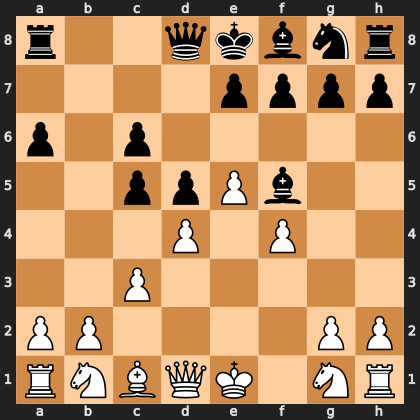

# Puzzle pe937bd4218

<!-- puzzle-id: pe937bd4218 | frame: original | fen: r2qkbnr/4pppp/p1p5/2ppPb2/3P1P2/2P5/PP4PP/RNBQK1NR w KQkq - 1 8 | type: missed_tactic -->

**White to move.** Find the best move.



```
    a b c d e f g h
  8 r . . q k b n r 8
  7 . . . . p p p p 7
  6 p . p . . . . . 6
  5 . . p p P b . . 5
  4 . . . P . P . . 4
  3 . . P . . . . . 3
  2 P P . . . . P P 2
  1 R N B Q K . N R 1
    a b c d e f g h
```

Board is drawn from White's side. Uppercase is White, lowercase is Black.

FEN: `r2qkbnr/4pppp/p1p5/2ppPb2/3P1P2/2P5/PP4PP/RNBQK1NR w KQkq - 1 8`

Status: unattempted | attempts: 0

<details><summary>Answer</summary>

Best move: `dxc5` (d4c5)

You played: `g1f3`

Eval before: +1.07
Win probability lost: 13.9
Refute depth: 4

Source: https://www.chess.com/game/live/172311344620, move 8

</details>
