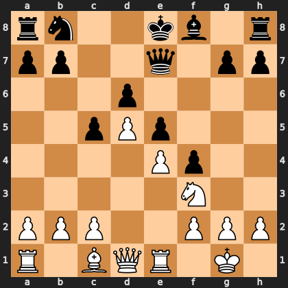

# Puzzle pbe4c3e10bc

<!-- puzzle-id: pbe4c3e10bc | frame: original | fen: rn2kb1r/pp2q1pp/3p4/2pPp3/4Pp2/5N2/PPP2PPP/R1BQR1K1 w kq - 0 11 | type: missed_tactic -->

**White to move.** Find the best move.



```
    a b c d e f g h
  8 r n . . k b . r 8
  7 p p . . q . p p 7
  6 . . . p . . . . 6
  5 . . p P p . . . 5
  4 . . . . P p . . 4
  3 . . . . . N . . 3
  2 P P P . . P P P 2
  1 R . B Q R . K . 1
    a b c d e f g h
```

Board is drawn from White's side. Uppercase is White, lowercase is Black.

FEN: `rn2kb1r/pp2q1pp/3p4/2pPp3/4Pp2/5N2/PPP2PPP/R1BQR1K1 w kq - 0 11`

Status: unattempted | attempts: 0

<details><summary>Answer</summary>

Best move: `Bxf4` (c1f4)

You played: `c2c3`

Eval before: +2.58
Win probability lost: 16.7
Refute depth: 7

Source: https://www.chess.com/game/daily/1008090490, move 11

</details>
