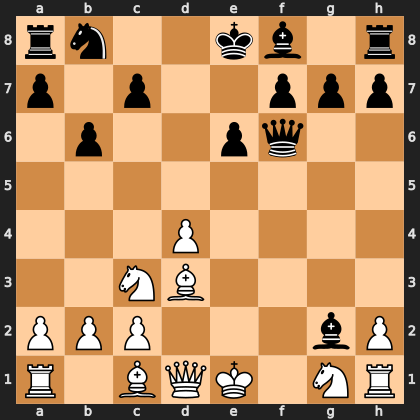

# Puzzle p57b6a5070f

<!-- puzzle-id: p57b6a5070f | frame: original | fen: rn2kb1r/p1p2ppp/1p2pq2/8/3P4/2NB4/PPP3bP/R1BQK1NR w KQkq - 0 9 | type: missed_tactic -->

**White to move.** Find the best move.



```
    a b c d e f g h
  8 r n . . k b . r 8
  7 p . p . . p p p 7
  6 . p . . p q . . 6
  5 . . . . . . . . 5
  4 . . . P . . . . 4
  3 . . N B . . . . 3
  2 P P P . . . b P 2
  1 R . B Q K . N R 1
    a b c d e f g h
```

Board is drawn from White's side. Uppercase is White, lowercase is Black.

FEN: `rn2kb1r/p1p2ppp/1p2pq2/8/3P4/2NB4/PPP3bP/R1BQK1NR w KQkq - 0 9`

Status: unattempted | attempts: 0

<details><summary>Answer</summary>

Best move: `Qg4` (d1g4)

You played: `c3e4`

Eval before: +3.98
Win probability lost: 57.6
Refute depth: 8

Source: https://www.chess.com/game/live/172539977052, move 9

</details>
