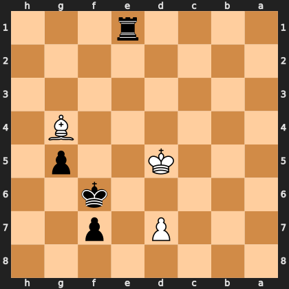

# Puzzle p9a511ff99d

<!-- puzzle-id: p9a511ff99d | frame: original | fen: 8/3P1p2/5k2/3K2p1/6B1/8/8/4r3 b - - 5 42 | type: endgame -->

**Black to move.** Find the best move, and name the method.



```
    h g f e d c b a
  1 . . . r . . . . 1
  2 . . . . . . . . 2
  3 . . . . . . . . 3
  4 . B . . . . . . 4
  5 . p . . K . . . 5
  6 . . k . . . . . 6
  7 . . p . P . . . 7
  8 . . . . . . . . 8
    h g f e d c b a
```

Board is drawn from Black's side. Uppercase is White, lowercase is Black.

FEN: `8/3P1p2/5k2/3K2p1/6B1/8/8/4r3 b - - 5 42`

Status: unattempted | attempts: 0

<details><summary>Answer</summary>

Best move: `Ke7` (f6e7)

You played: `e1d1`

Eval before: -79.32
Win probability lost: 95.1
Refute depth: 8

Source: https://www.chess.com/game/daily/1010369486, move 42

</details>
