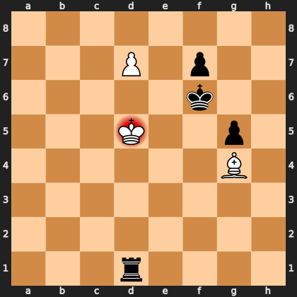

# Puzzle pe245016e29

<!-- puzzle-id: pe245016e29 | frame: original | fen: 8/3P1p2/5k2/3K2p1/6B1/8/8/3r4 w - - 6 43 | type: endgame -->

**White to move.** Find the best move, and name the method.



```
    a b c d e f g h
  8 . . . . . . . . 8
  7 . . . P . p . . 7
  6 . . . . . k . . 6
  5 . . . K . . p . 5
  4 . . . . . . B . 4
  3 . . . . . . . . 3
  2 . . . . . . . . 2
  1 . . . r . . . . 1
    a b c d e f g h
```

Board is drawn from White's side. Uppercase is White, lowercase is Black.

FEN: `8/3P1p2/5k2/3K2p1/6B1/8/8/3r4 w - - 6 43`

Status: unattempted | attempts: 0

<details><summary>Answer</summary>

Best move: `Bxd1` (g4d1)

You played: `d5c6`

Eval before: M19
Win probability lost: 95.1
Refute depth: 7

Source: https://www.chess.com/game/daily/1010369486, move 43

</details>
