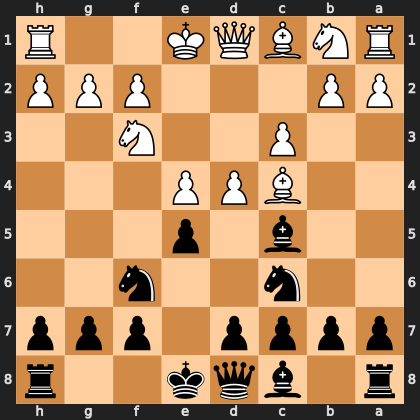

# Puzzle p13732f92c8

<!-- puzzle-id: p13732f92c8 | frame: original | fen: r1bqk2r/pppp1ppp/2n2n2/2b1p3/2BPP3/2P2N2/PP3PPP/RNBQK2R b KQkq - 0 5 | type: missed_tactic -->

**Black to move.** Find the best move.



```
    h g f e d c b a
  1 R . . K Q B N R 1
  2 P P P . . . P P 2
  3 . . N . . P . . 3
  4 . . . P P B . . 4
  5 . . . p . b . . 5
  6 . . n . . n . . 6
  7 p p p . p p p p 7
  8 r . . k q b . r 8
    h g f e d c b a
```

Board is drawn from Black's side. Uppercase is White, lowercase is Black.

FEN: `r1bqk2r/pppp1ppp/2n2n2/2b1p3/2BPP3/2P2N2/PP3PPP/RNBQK2R b KQkq - 0 5`

Status: unattempted | attempts: 0

<details><summary>Answer</summary>

Best move: `exd4` (e5d4)

You played: `d7d5`

Eval before: +0.07
Win probability lost: 26.7
Refute depth: 5

Source: https://www.chess.com/game/live/172754563870, move 5

</details>
