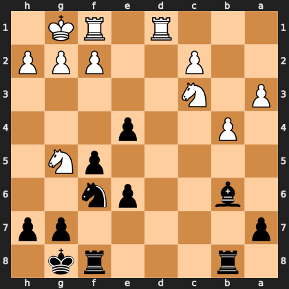

# Puzzle p351ecaf3cc

<!-- puzzle-id: p351ecaf3cc | frame: original | fen: 1r3rk1/p5pp/1b2pn2/5pN1/1P2p3/P1N5/2P2PPP/3R1RK1 b - - 2 16 | type: missed_tactic -->

**Black to move.** Find the best move.



```
    h g f e d c b a
  1 . K R . R . . . 1
  2 P P P . . P . . 2
  3 . . . . . N . P 3
  4 . . . p . . P . 4
  5 . N p . . . . . 5
  6 . . n p . . b . 6
  7 p p . . . . . p 7
  8 . k r . . . r . 8
    h g f e d c b a
```

Board is drawn from Black's side. Uppercase is White, lowercase is Black.

FEN: `1r3rk1/p5pp/1b2pn2/5pN1/1P2p3/P1N5/2P2PPP/3R1RK1 b - - 2 16`

Status: unattempted | attempts: 0

<details><summary>Answer</summary>

Best move: `e3` (e4e3)

You played: `b8c8`

Eval before: -3.02
Win probability lost: 21.1
Refute depth: 6

Source: https://www.chess.com/game/daily/1017020672, move 16

</details>
