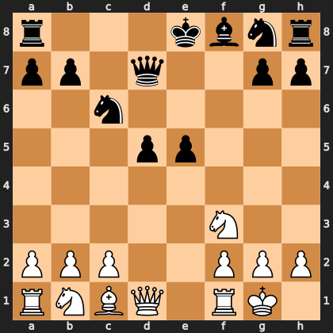

# Puzzle p237d93ae56

<!-- puzzle-id: p237d93ae56 | frame: original | fen: r3kbnr/pp1q2pp/2n5/3pp3/8/5N2/PPP2PPP/RNBQ1RK1 w kq - 0 10 | type: missed_tactic -->

**White to move.** Find the best move.



```
    a b c d e f g h
  8 r . . . k b n r 8
  7 p p . q . . p p 7
  6 . . n . . . . . 6
  5 . . . p p . . . 5
  4 . . . . . . . . 4
  3 . . . . . N . . 3
  2 P P P . . P P P 2
  1 R N B Q . R K . 1
    a b c d e f g h
```

Board is drawn from White's side. Uppercase is White, lowercase is Black.

FEN: `r3kbnr/pp1q2pp/2n5/3pp3/8/5N2/PPP2PPP/RNBQ1RK1 w kq - 0 10`

Status: unattempted | attempts: 0

<details><summary>Answer</summary>

Best move: `Nxe5` (f3e5)

You played: `f1e1`

Eval before: +1.48
Win probability lost: 14.7
Refute depth: 5

Source: https://www.chess.com/game/daily/1017562048, move 10

</details>
