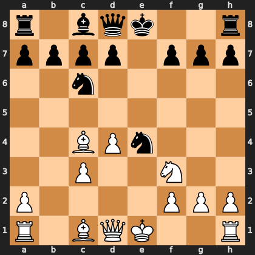

# Puzzle pc3100387b0

<!-- puzzle-id: pc3100387b0 | frame: original | fen: r1bqk2r/pppp1ppp/2n5/8/2BPn3/2P2N2/P4PPP/R1BQK2R w KQkq - 0 9 | type: missed_tactic -->

**White to move.** Find the best move.



```
    a b c d e f g h
  8 r . b q k . . r 8
  7 p p p p . p p p 7
  6 . . n . . . . . 6
  5 . . . . . . . . 5
  4 . . B P n . . . 4
  3 . . P . . N . . 3
  2 P . . . . P P P 2
  1 R . B Q K . . R 1
    a b c d e f g h
```

Board is drawn from White's side. Uppercase is White, lowercase is Black.

FEN: `r1bqk2r/pppp1ppp/2n5/8/2BPn3/2P2N2/P4PPP/R1BQK2R w KQkq - 0 9`

Status: unattempted | attempts: 0

<details><summary>Answer</summary>

Best move: `d5` (d4d5)

You played: `d1e2`

Eval before: +0.63
Win probability lost: 13.3
Refute depth: 5

Source: https://www.chess.com/game/daily/1008631838, move 9

</details>
