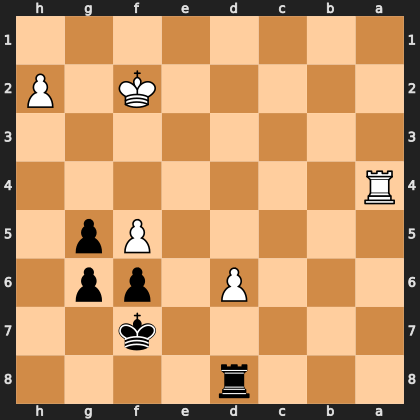

# Puzzle p01ad00d56d

<!-- puzzle-id: p01ad00d56d | frame: original | fen: 3r4/5k2/3P1pp1/5Pp1/R7/8/5K1P/8 b - - 0 37 | type: missed_tactic -->

**Black to move.** Find the best move.



```
    h g f e d c b a
  1 . . . . . . . . 1
  2 P . K . . . . . 2
  3 . . . . . . . . 3
  4 . . . . . . . R 4
  5 . p P . . . . . 5
  6 . p p . P . . . 6
  7 . . k . . . . . 7
  8 . . . . r . . . 8
    h g f e d c b a
```

Board is drawn from Black's side. Uppercase is White, lowercase is Black.

FEN: `3r4/5k2/3P1pp1/5Pp1/R7/8/5K1P/8 b - - 0 37`

Status: unattempted | attempts: 0

<details><summary>Answer</summary>

Best move: `gxf5` (g6f5)

You played: `d8d6`

Eval before: -4.22
Win probability lost: 32.3
Refute depth: 4

Source: https://www.chess.com/game/live/171984928774, move 37

</details>
