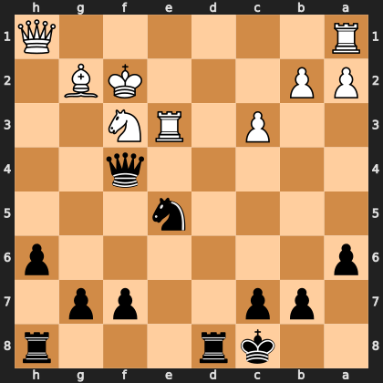

# Puzzle p0c7e4ff91f

<!-- puzzle-id: p0c7e4ff91f | frame: original | fen: 2kr3r/1pp2pp1/p6p/4n3/5q2/2P1RN2/PP3KB1/R6Q b - - 3 24 | type: missed_tactic -->

**Black to move.** Find the best move.



```
    h g f e d c b a
  1 Q . . . . . . R 1
  2 . B K . . . P P 2
  3 . . N R . P . . 3
  4 . . q . . . . . 4
  5 . . . n . . . . 5
  6 p . . . . . . p 6
  7 . p p . . p p . 7
  8 r . . . r k . . 8
    h g f e d c b a
```

Board is drawn from Black's side. Uppercase is White, lowercase is Black.

FEN: `2kr3r/1pp2pp1/p6p/4n3/5q2/2P1RN2/PP3KB1/R6Q b - - 3 24`

Status: unattempted | attempts: 0

<details><summary>Answer</summary>

Best move: `Ng4+` (e5g4)

You played: `e5d3`

Eval before: -6.85
Win probability lost: 35.4
Refute depth: 3

Source: https://www.chess.com/game/live/171987878016, move 24

</details>
