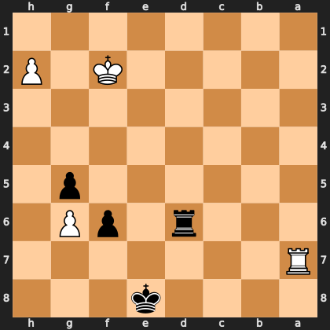

# Puzzle p3126684ef0

<!-- puzzle-id: p3126684ef0 | frame: original | fen: 4k3/R7/3r1pP1/6p1/8/8/5K1P/8 b - - 0 39 | type: endgame -->

**Black to move.** Find the best move, and name the method.



```
    h g f e d c b a
  1 . . . . . . . . 1
  2 P . K . . . . . 2
  3 . . . . . . . . 3
  4 . . . . . . . . 4
  5 . p . . . . . . 5
  6 . P p . r . . . 6
  7 . . . . . . . R 7
  8 . . . k . . . . 8
    h g f e d c b a
```

Board is drawn from Black's side. Uppercase is White, lowercase is Black.

FEN: `4k3/R7/3r1pP1/6p1/8/8/5K1P/8 b - - 0 39`

Status: unattempted | attempts: 0

<details><summary>Answer</summary>

Best move: `Kf8` (e8f8)

You played: `d6d7`

Eval before: +0.00
Win probability lost: 47.5
Refute depth: 7

Source: https://www.chess.com/game/live/171984928774, move 39

</details>
