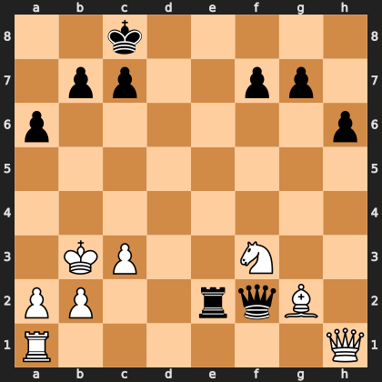

# Puzzle p379b42dc69

<!-- puzzle-id: p379b42dc69 | frame: original | fen: 2k5/1pp2pp1/p6p/8/8/1KP2N2/PP2rqB1/R6Q w - - 5 30 | type: missed_tactic -->

**White to move.** Find the best move.



```
    a b c d e f g h
  8 . . k . . . . . 8
  7 . p p . . p p . 7
  6 p . . . . . . p 6
  5 . . . . . . . . 5
  4 . . . . . . . . 4
  3 . K P . . N . . 3
  2 P P . . r q B . 2
  1 R . . . . . . Q 1
    a b c d e f g h
```

Board is drawn from White's side. Uppercase is White, lowercase is Black.

FEN: `2k5/1pp2pp1/p6p/8/8/1KP2N2/PP2rqB1/R6Q w - - 5 30`

Status: unattempted | attempts: 0

<details><summary>Answer</summary>

Best move: `Bh3+` (g2h3)

You played: `h1f1`

Eval before: +2.89
Win probability lost: 71.9
Refute depth: 6

Source: https://www.chess.com/game/live/171987878016, move 30

</details>
